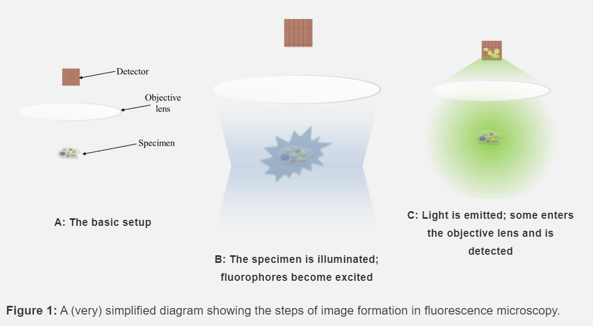
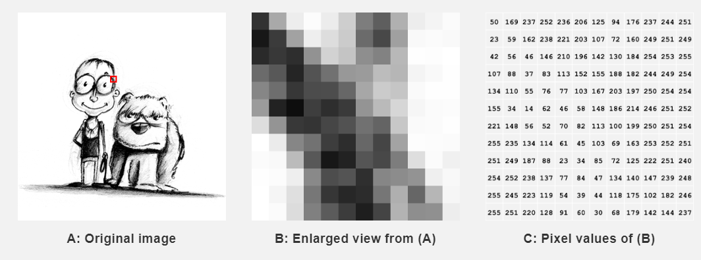

```{r setup, include=FALSE}
options(htmltools.dir.version = FALSE)
```

```{r xaringan-themer, include = FALSE}
library(xaringanthemer)
mono_light(
  base_color = "midnightblue",
  header_font_google = google_font("Josefin Sans"),
  text_font_google   = google_font("Montserrat", "300", "300i"),
  code_font_google   = google_font("Droid Mono"),
  link_color = "deepskyblue1",
  text_font_size = "28px"
)
```

# Learning Objectives

- **Understand** how confocal microscope images are acquired by a system
- **Learn** about how images are represented 
- **Learn** about the types of numeric values we can use as intensities in an image
- **Learn** about histograms 
- **Understand** the Structure of an RStudio Project


---
# Confocal Microscope Images



---
# Dynamic Range and Depth

- Depending on the amount of observed fluoresence, our detector (our camera) can quantify it as a number.


---
# Detecting Things

- Our overall focus in this course is in **detecting** and quantifying cells and cellular proteins and their location in an image.
- What are some cellular structures we'd like to detect?

---

# What are Images?

- Images are represented as an **array** of numbers
- Horizontal Lines of an image correspond to *rows* in the table
- Vertical Lines of an image correspond to *columns* of the table

 
]

.footnote[https://petebankhead.gitbooks.io/imagej-intro/content/chapters/images_and_pixels/images_and_pixels.html]

---
# Arrays

Images are an example of what is called a *matrix* or a 2 dimensional *array*.

An array has *columns*, and *rows*

---
# Rows and Columns

This is a 200 x 200 pixel image


The first number refers to the number of rows in an image

200    x   200
*Columns* x *Rows*

---
# Image

```{r echo=FALSE}
image <- EBImage::readImage("image/kid_example.tif")
plot(image)
```

---
# Orienting ourselves

Top left corner of the table is always referred to as [1,1]

---
# Subsetting an Image

If we wanted to get the bottom left quadrant of the photo, we want a subimage of 100 x 100 pixels. 

How do we get this?

Well, we can use technique called *subsetting* to get this quadrant.

We want the first 100 columns and the last 100 rows of our image. How do we refer to this?

---
# Image indexing

If our loaded image is called `image`, we use the bracket (`[,]`) notation to refer to *rows* and *columns* in it.

.pull-left[
```{r echo=FALSE}
plot(image)
```
]

.pull-right[
```{r echo=FALSE}
plot(image[1:100, 101:200])
```
]
The `51:100` and `1:50` are called `sequences`. They are a short hand for *every number between* 51 and 100 (including 51 and 100).

What does the sequence `1:50` refer to? Is this sequence referring to the rows or columns?

---
# Check yourself

If we have a 100 x 100 pixel image, how do we refer to the top right quadrant? (use the format `image[a:b, x:y]`)

---
# Intensity

The numeric value at a particular pixel represents the intensity of light at that particular image.

These numeric values can either be:

- A unsigned Integer (0-127)
- Decimal (also known as Floating point) (0.156, 0.630, etc)
---
# Bit Depth

Images are usually acquired as integers represented as binary numbers. 

- Each value for a cell takes a little bit of memory in the file
- Most images use unsigned integers to store values
- A 8-bit image can have 2^8, or 128 different values, ranging from 0-127
- Want the number of bits per pixel to be as large as possible
- 0 is black, 127 is white

---
# Transformed images

- Usually have decimal values (0.1, 0.33, 0.555), etc
- Usually range from 0 to 1
- File size can be larger than integer-valued images

---
# Intensity Histograms

One of our most useful tools for understanding an image is the **intensity histogram**.

Our x-axis is our intensity value, and our y-axis are the number of pixels in our image that have that particular intensity value.

---
# What can you tell from this histogram?

```{r echo=FALSE}
hist(image)
```

---
# Check Yourself

- Are the pixel values *floating point* or *integer*?
- What is the maximum observed value in the image?

```{r echo=FALSE}
hist(image)
```

---
# Color images 

Color images are usually represented by three different intensity values, that are stored in separate *layers* within the file: 

- one for Red 
- one for Blue
- one for Green

---
# Channels

Sometimes you use a different stain to label different proteins. Then the different intensity values correspond to **channels**.

We often do this when we're interested in quantifying whether two proteins are *co-located*. 

To do this, we will need to process each channel separately, and then combine the results in the end.

---
# Processing Image Workflow

---
# RStudio Cloud

- Web based version of RStudio
- All software is installed for you

---
# Opening up the Project


---
# Exporting Data


---
# Rstudio Projects


---
# Thursday's Lab

- Learning R/RStudio
- Loading images
- Making histograms

---
# Reading 

- [R and RStudio Basics](https://ismayc.github.io/rbasics-book/3-rstudiobasics.html) - make sure to watch the videos
- [Images and Pixels](https://petebankhead.gitbooks.io/imagej-intro/content/chapters/images_and_pixels/images_and_pixels.html)
- [Types and Bit Depths](https://petebankhead.gitbooks.io/imagej-intro/content/chapters/bit_depths/bit_depths.html)
