```{r xaringan-themer, include = FALSE}
library(xaringanthemer)
mono_light(
  base_color = "midnightblue",
  header_font_google = google_font("Josefin Sans"),
  text_font_google   = google_font("Montserrat", "300", "300i"),
  code_font_google   = google_font("Droid Mono"),
  link_color = "deepskyblue1",
  text_font_size = "28px"
)
```


# Sharing Session

- For 10 minutes before lecture, we'll discuss assignments, or past muddiest points

---
# Learning Objectives

- **Learn** about *histograms* and **use** them to understand the distribution of values in an image
- **Learn** about *numerical transformations* on image data and how to **apply** them to images
- **Learn** about *filters* and **apply** them to images

---
# Glossary

- **transformation** - performing a numeric operation on the pixel values of an image
- **global** transformations - an operation that is applied to all of the pixel values at once. Also known as **point operations**.
- **local transformations** - an operation that is applied one pixel at a time, usually dependent on the *neighborhood* of this pixel. 
- **filtering** - a specific type of *local transformation* that uses a pixel value and the value of its neighboring pixels
- **neighborhood** - an area of pixels that is centered around one pixel. The smallest neighborhood is 3 pixels by 3 pixels = 9 pixels total, which form a "moat" around the center pixel.

---
# What are some problems with Microscope Images?

- Noise (often from Exposure)
- Uneven Illumination
- Overexposure/Photobleaching
- Part of your reading: [Fluoresecence Microscopy: Avoiding the Pitfalls.](https://jcs.biologists.org/content/joces/120/10/1703.full.pdf)

---
# First Do No Harm

- Do as little as possible to images when preprocessing them.
- Be Transparent and share your workflow
- A fine balance between denoising and losing structures in your data
- Always assess the impact of your method!

---
# Point operations

```
image + 0.2
```

```
image * 2
```

???

- Point operations, also known as **global** operations, are mathematical operations that operate on all of the pixels in an image
- We can do things like add a value (0.1) to all pixels, or subtract values.

---
# Normalization

- Scale depth of image to fit minimums and maximums of image

.pull-left[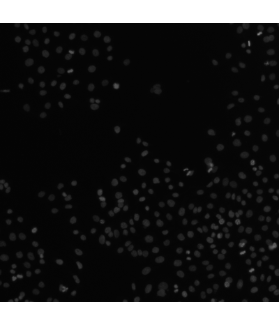]

.pull-right[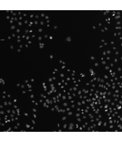]

---
# Compare Histograms

.pull-left[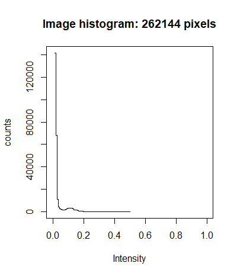]

.pull-right[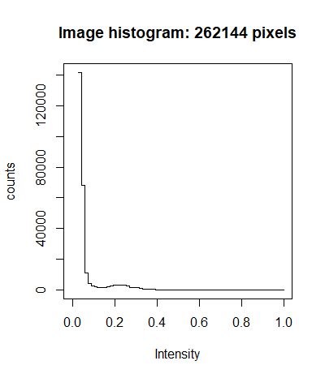]

---
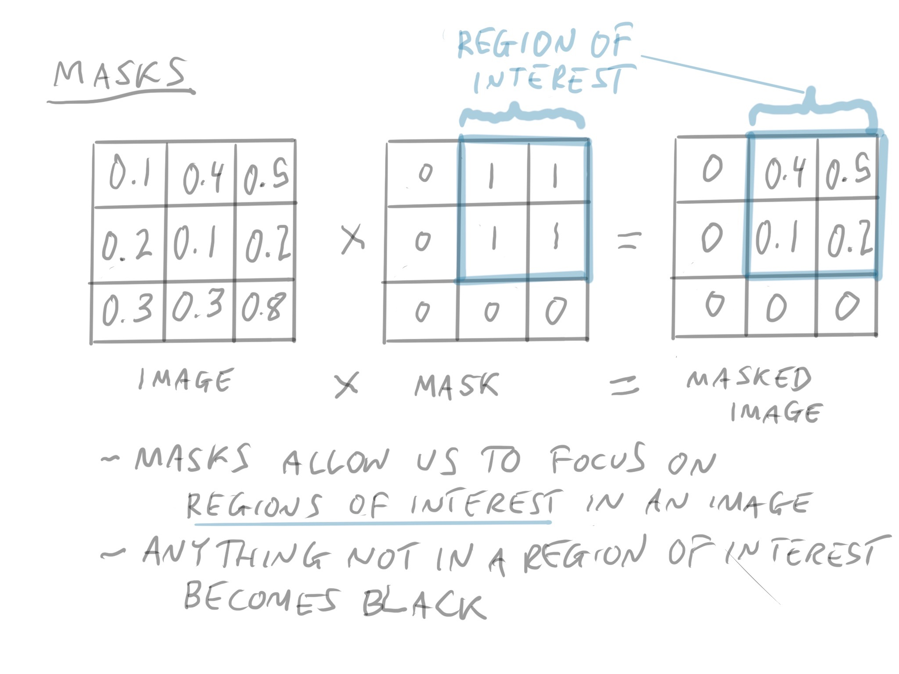

???

- One type of point operation that is very useful is *masking*, where a "region of interest" is defined in our image.
- We may want to remove certain parts of the image, because they are not an area of the image that we are intersted in
- You can define a region of interest mathematically, or by drawing it in manually
- Everything not in the region of interest gets zeroed out (becomes black)

---
# Noise in fluoresence microscopy

- Noise around an object can affect the *shape*, or *border* of the object that is detected
- We'll investigate the sources of noise further later
- Can affect the area that is measured for the object
- Can we fix this? Yes, we can, with *filters*!

---
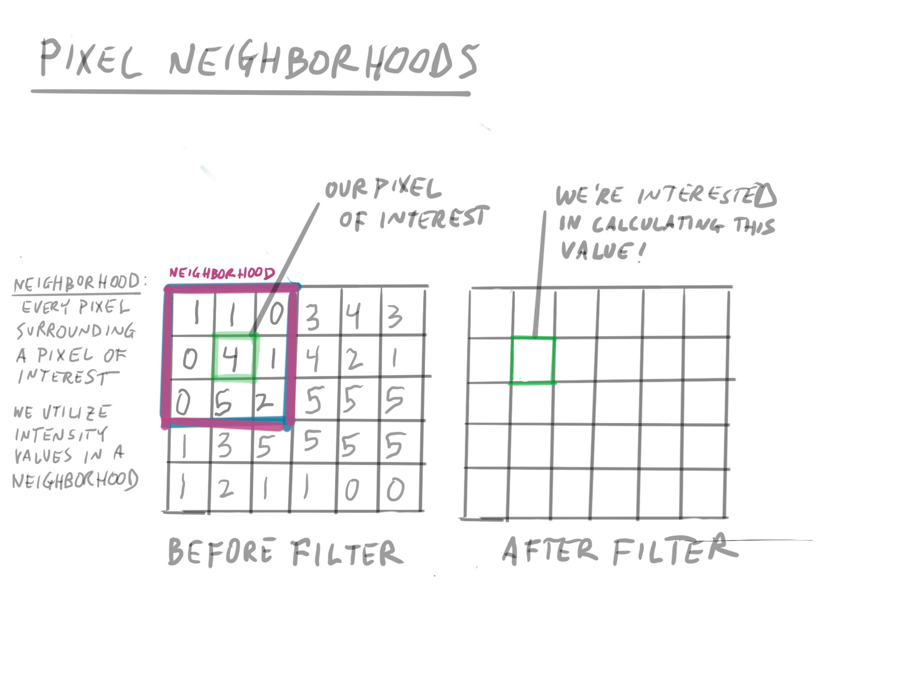

???

- The first concept we need to define with a filter is a *neighborhood*.
- The neighborhood is defined as the pixels that surround a pixel of interest (including the pixel of interest)
- We utilize intensity values of the pixels in the neighborhood to transform the intensity value of our pixel of interest
- Neighborhoods can have different shapes, square, circular, or other shapes
- The matrix on the right is our image before filtering. We're using integer values here just because it's easier
- The pixel of interest is in green, and its 3x3 neighborhood are those pixels that surround it

---

# Filtering using a mean filter

.pull-left[
- Applying an operation using values around a pixel, or the pixel neighborhood
- Take all nine values in a neighborhood, multiply by 1/9, and then add them
- The "1/9" is known as a weight
- They're also called *convolutional* filters
]

.pull-right[
  
]

.footnote[https://petebankhead.gitbooks.io/imagej-intro/content/chapters/filters/filters.html]

---
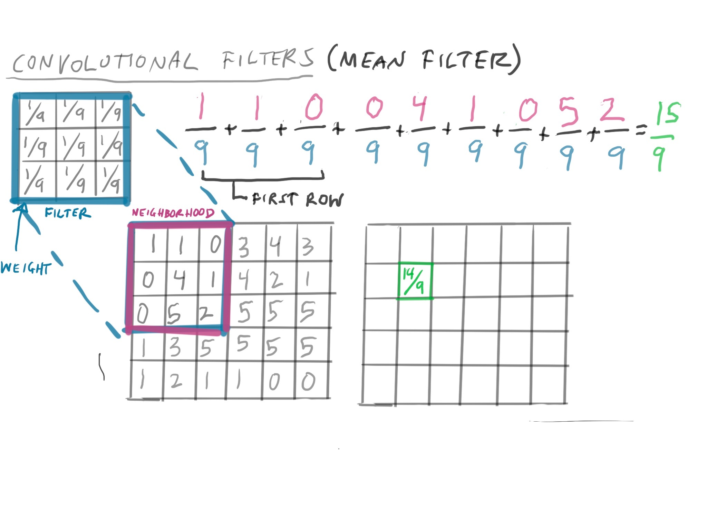

---
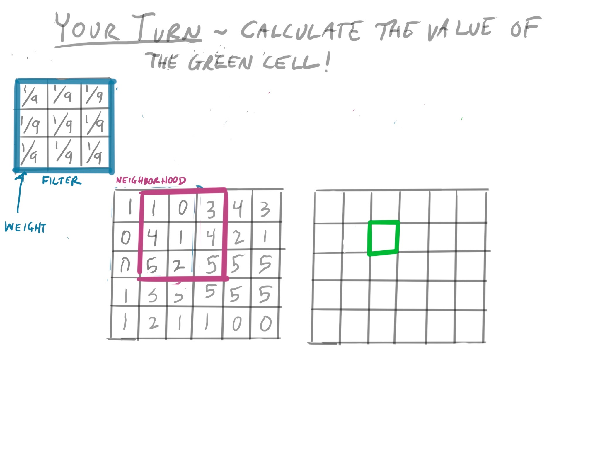

---
.pull-left[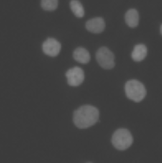]

.pull-right[]

???

What is the result of this? The image seems a little more smoothed out and blurry.

Again, this will help us smooth out the edges of our nuclei, which will help us measure them in a consistent manner.

---
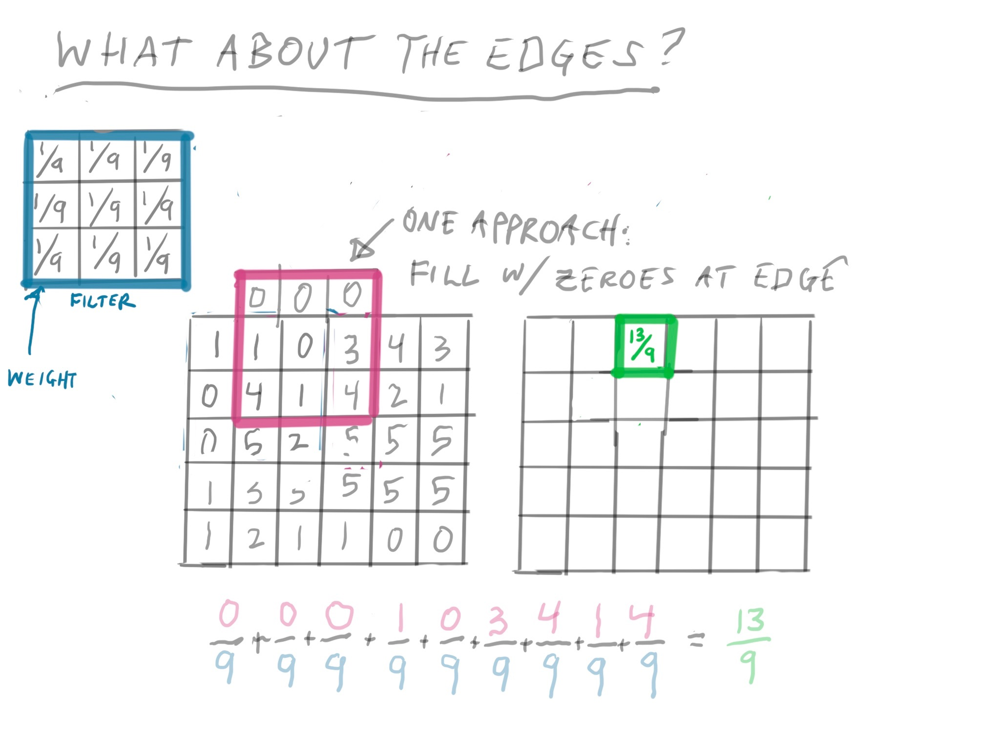

???

You may have noticed that we haven't accounted for the edge pixels. How do we calculate them?

Here's one strategy: filling in a row of zeroes for the top edge.

---
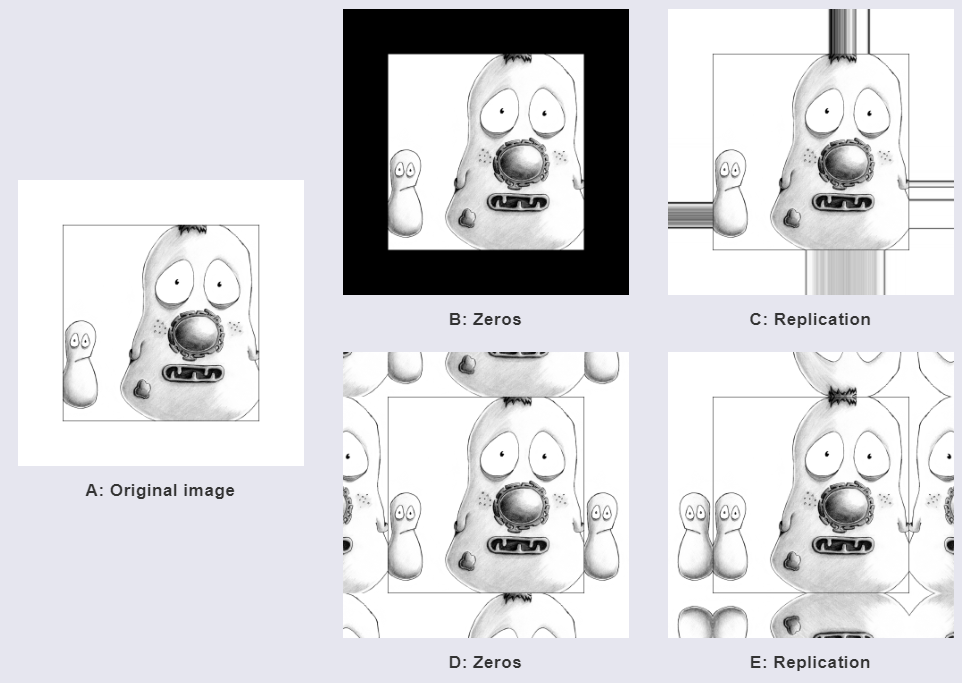

.footnote[https://petebankhead.gitbooks.io/imagej-intro/content/chapters/filters/filters.html]

???

There are other strategies that you might use.
---
# Variations: Median Filtering

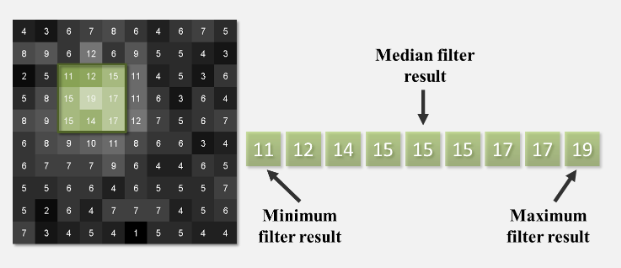

.footnote[https://petebankhead.gitbooks.io/imagej-intro/content/chapters/filters/filters.html]

???

- Sort all values in a neighborhood, and return the center value
- "ignores" extreme values in a neighborhood.

---
.pull-left[]

.pull-right[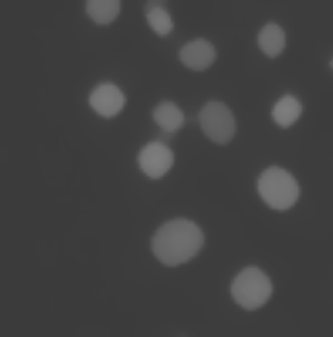]

---

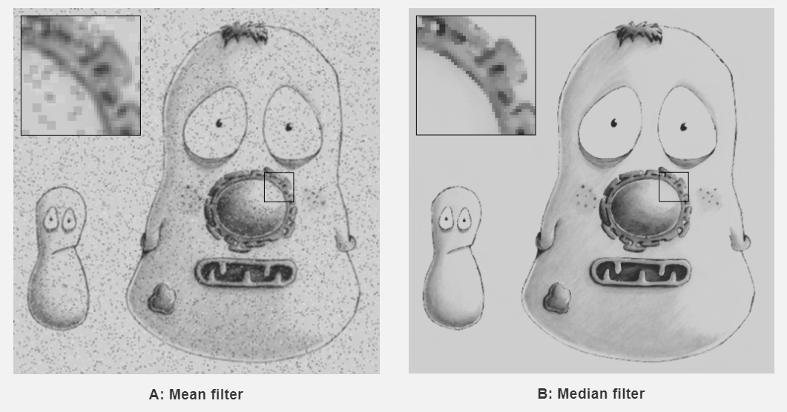

???

- Median filtering has one strength above mean filtering. 
- Median filtering ignores the *extreme* values in a neighborhood
- That means it can help reduce noise in images, as you can see in the example above.

---
# Variations: Gaussian Filters

- Neighborhood and its weight are defined by 2-D *gaussian* functions around a point
- Avoids "blockiness"

   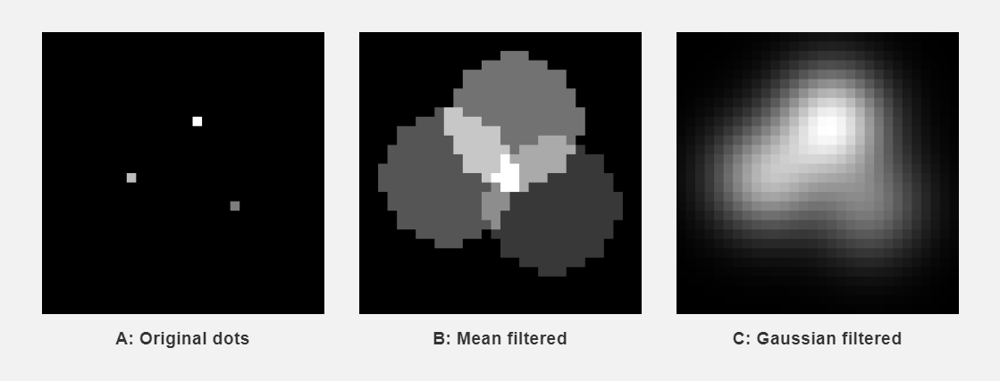

---

.pull-left[]

.pull-right[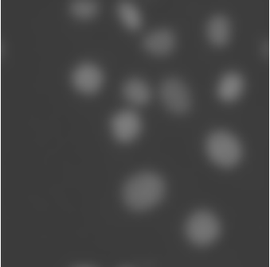]

???

Here is a gaussian filter with a slightly larger sigma. 

---
# What about Photoshop?

- Almost all effects in photoshop are global or local manipulations on an image.
- Neighborhoods are defined differently (also known as "brushes")

---
# Take home points

- We can transform images with either **global** or **local** operations
- **Global operations**: transforming the data, including addition, subtraction, and scaling, or normalizing the data 
- We assess the effects of *global operations* by looking at the histogram
- **Local operations**: filtering, including mean filtering, median filtering, and gaussian filtering
- We assess the effects of local operations by examining the image and seeing the effect of the filter on downstream operations
- **Neighborhoods** define which pixel values we incorporate into a local operation

---
# When to use what filter & transformation

These are the main ones to consider at this point.

- *normalization* - your image is dim, and you want it to be comparable
- *masking* - there are structures in your image that you want the algorithm to ignore
- *mean filtering* - Median is probably preferable in most situations
- *median filtering* - Your images are noisy!
- *gaussian filtering* - can be used in illumination correction, and the weights can be fine turned

---
# The Lab

- Looking at global operations
- Looking at filtering operations
- Later on: assessing their impact on downstream analysis

---
# Reading

Please read these sections before the lab.

- [Fluoresecence Microscopy: Avoiding the Pitfalls.](https://jcs.biologists.org/content/joces/120/10/1703.full.pdf)
- [Processing and Analysis](https://petebankhead.gitbooks.io/imagej-intro/content/chapters/processing_and_analysis/processing_and_analysis.html)
- [Point Operations](https://petebankhead.gitbooks.io/imagej-intro/content/chapters/point_operations/point_operations.html)

---
# Survey

Remember to take the survey!

https://ohsu.ca1.qualtrics.com/jfe/form/SV_e99ek34B878dGap