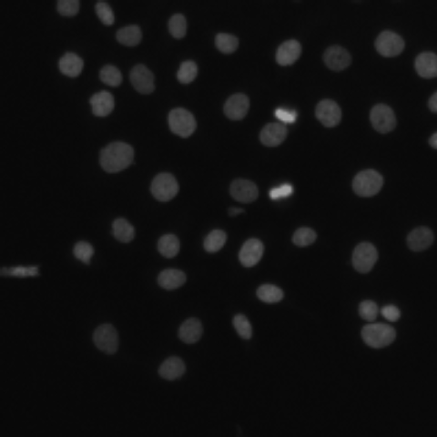

```{r setup, include=FALSE}
options(htmltools.dir.version = FALSE)
```

```{r xaringan-themer, include = FALSE}
library(xaringanthemer)
mono_light(
  base_color = "midnightblue",
  header_font_google = google_font("Josefin Sans"),
  text_font_google   = google_font("Montserrat", "300", "300i"),
  code_font_google   = google_font("Droid Mono"),
  link_color = "deepskyblue1",
  text_font_size = "28px"
)
```
# Review of Lab Session

- Any questions about lab?
---
class: center, middle
# Image Thresholding and Binarization

---
# Learning Objectives

- **Learn** about *manual* and *adaptive* thresholding on an image to *binarize* it
- **Learn** about *Otsu's method* to select a threshold on an image
- **Learn** about *erosion* and *dilation* to fix artefacts in a binarized image

---
# Glossary

- **Region of Interest** - Part of an image where you want the analysis to concentrate on
- **Binarized image** - an image whose intensities have been reduced to two values: 0 and 1.
- **Threshold** - a cutoff that determines which intensity values become zero and which become 1. Those values that are above the cutoff become 0, and those above become 1
- **Otsu's Method** - A automated method for deciding a threshold
---
# Glossary Part 2

- **adaptive thresholding** - applying a different threshold value to different regions of the image based on local values
- **erosion** - applying a minimum value filter to an image - results in reducing the border around an image
- **dilation** - applying a maximum value filter to an image

---
# Thresholding

.pull-left[]
.pull-right[]

???

**Segmenting** structures in image (also known as *object detection*) requires binarized images.

When we binarize, we take out all of the shades of grey in our image and make it black and white.

---


???

So how do we decide the threshold for determining what is black and what is white?

---


???

One way to do it is to do it manually - careful inspection of the image's histogram.

---
# Manual Example

.pull-left[]

.pull-right[]

???

---
# Otsu's Threshold


.footnote[By Lucas(CA) - Own work, CC BY-SA 4.0, https://commons.wikimedia.org/w/index.php?curid=67144384]

???

Otsu's method is a way of deciding a threshold based on maximizing the variability between the 0-valued pixels and the 1 valued-pixels.

In this gif, we can see the variability plotted as a curve. Once we have this curve, we can find its maximum using calculus, and the maximum is our threshold.

---
# Otsu's Threshold

.pull-left[]

.pull-right[]

---


???

Much like filtering, we can use *neighborhoods* around a pixel to decide a threshold. This can help in situations where the illumination is uneven. This method is called *adaptive thresholding*.

We need to decide the size of our neighborhood. Then we build a "local" histogram from that and apply a thresholding algorithm to that local histogram. 

---


???

Here's another neighborhood and the mini histogram

In R, that neighborhood can be varied by both height and width.

---
# More about adaptive thresholding

http://homepages.inf.ed.ac.uk/rbf/HIPR2/adpthrsh.htm

---
# Adaptive Example

.pull-left[
Otsu's Threshold]

.pull-right[
Adaptive Threshold]

---
# Now what?

- Examine binarized images for artefacts introduced in preprocessing
- Attempt to fix these artefacts
- Dilation and Erosion (manual)

---


???

- One thing we can do to fix our images is an operation called *dilation*.
- *dilation* is a maximum filter on a neighborhood. 
- When the filter is on the edge of an object that is black and white, it will expand the object at its edges
- *dilation* can be really good at fixing "holes" in our objects

---
# Dilation

.pull-left[Otsu Threshold Image
]
.pull-right[Dilated image ]


---


???

- The reverse operation is called *erosion*, where the object is a minimum filter
- The result is that the object becomes smaller at the edges

---
# Erosion

.pull-left[Otsu Threshold Image
]
.pull-right[Eroded image ]

---
# Opening

- *erosion* followed by *dilation*

.pull-left[Otsu Threshold Image
]
.pull-right[Opened image ]

---
# Closing

- *dilation* followed by *erosion*

.pull-left[
Otsu Threshold Image]
.pull-right[ Opened image]


---
# Discussion

In breakout rooms, compare the opened and closed images.

Which operation is more appropriate?

Did the operations fix issues or create them?

---
# Your neighborhood's shape matters

.pull-left[ image before opening with circular neighborhood ]
.pull-right[ image after opening with circular neighborhood ]

.footnote[https://homepages.inf.ed.ac.uk/rbf/HIPR2/open.htm]
---
# Lab Next time

- Region of Interest
- Thresholding testing
- Erosion/Dilation

---
# Reading:

Please read these sections before the lab.

- [Detection By Thresholding](https://petebankhead.gitbooks.io/imagej-intro/content/chapters/thresholding/thresholding.html)
- [Binary Images](https://petebankhead.gitbooks.io/imagej-intro/content/chapters/binary/binary.html)

---
# Survey

Fill out the survey: 

https://ohsu.ca1.qualtrics.com/jfe/form/SV_e99ek34B878dGap
