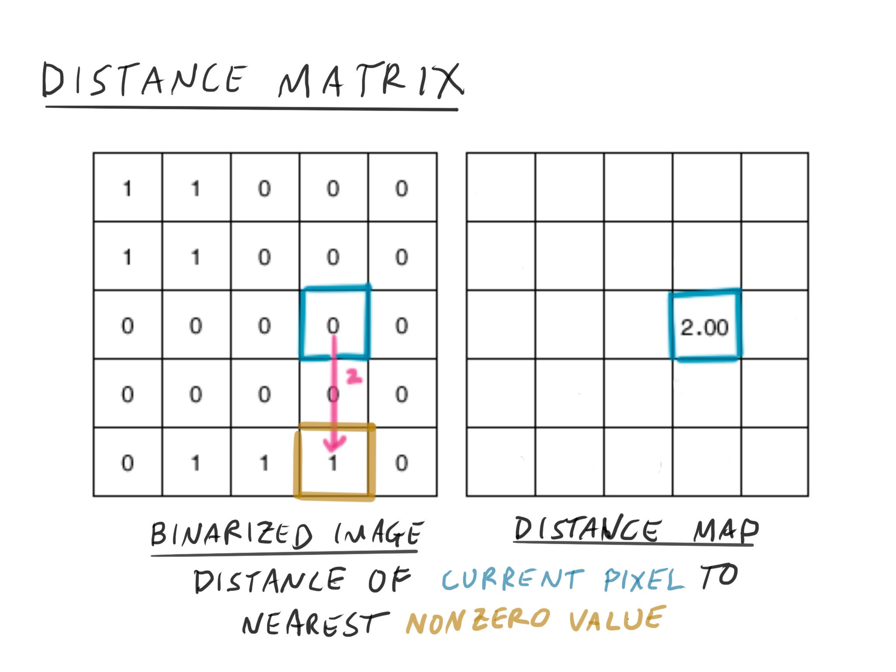
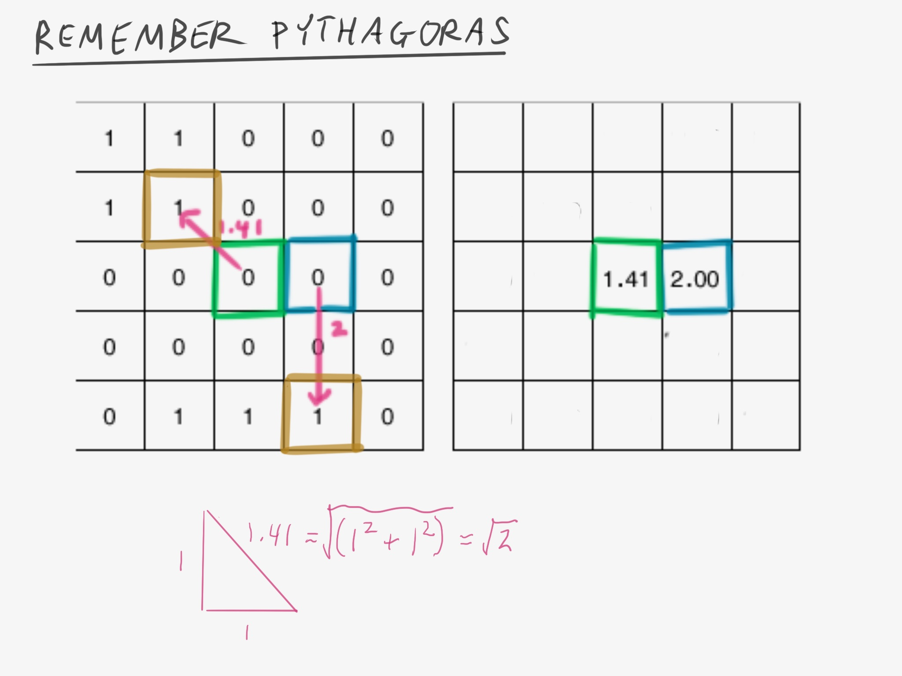

```{r setup, include=FALSE}
library(EBImage)
library(gt)
image <- readImage("image/week4/mickey.png",all = FALSE)
image <- image[,,1]
colorMode(image) <- "grayscale"
micro_image <- readImage("image/week3/otsu_image.png")
micro_image <- micro_image[,,1]
colorMode(micro_image) <- "grayscale"
```

```{r xaringan-themer, include = FALSE}
library(xaringanthemer)
mono_light(
  base_color = "midnightblue",
  header_font_google = google_font("Josefin Sans"),
  text_font_google   = google_font("Montserrat", "300", "300i"),
  code_font_google   = google_font("Droid Mono"),
  link_color = "deepskyblue1",
  text_font_size = "28px"
)
```


class: center, middle
# Where are those nuclei?
---
# Learning Objectives

- **Learn** and **apply** *segmentation* algorithms to detect objects in an image
- **Use** a distance transform to find the centers of a detected object
- **Learn** about the watershed algorithm and how it can segment overlapping objects

---
# What is Segmentation?


???

Image segmentation is the detection of objects within an image. 

As you probably gather, image segmentation is critical in many applications of machine vision, including automated face detection, and self-driving cars.

Image from: https://www.analyticsvidhya.com/blog/2019/04/introduction-image-segmentation-techniques-python/

---
# Simple segmentation

```{r echo=FALSE, message=FALSE}
mask <- bwlabel(micro_image)
```

.pull-left[
```{r echo=FALSE}
plot(micro_image)
```
]

.pull-right[
```{r echo=FALSE}
plot(colorLabels(mask))
```
]

???

---
# Label Matrix

```{r echo=FALSE}
imageData(mask)[105:115, 77:87]
```

???

We transform our binary matrix into a label matrix - each object has a specific label (number), and all pixels that belong to that object have the same value as the label.


---
class: center, middle
# We can do better
---
# Starting point: Binarized image

```{r echo=FALSE}
dist_image <- distmap(image)
di <- dist_image
dist_image <- normalize(dist_image)
```

.pull-left[
```{r echo=FALSE}
plot(image)
```
]

---




???

Our distance metric is calculated from our pixel of interest. It is the number of pixels from our pixel to the closest non-zero pixel. 

In our example, the distance between our pixel (in blue) and the closest non-zero pixel (in orange) is 2.

Adapted from https://www.mathworks.com/company/newsletters/articles/the-watershed-transform-strategies-for-image-segmentation.html


---




???

If our closest non-zero pixel is on a diagonal, we have to apply the Pythagorean theorem to get the length of the diagonal, which we use as our distance.

Adapted from https://www.mathworks.com/company/newsletters/articles/the-watershed-transform-strategies-for-image-segmentation.html


---


---
# Distance Transform

.pull-left[
```{r}
plot(image)
```
]

.pull-right[
```{r}
plot(dist_image)
```
]


---
```{r echo=FALSE, message=FALSE, warning=FALSE}
library(plotly)
invert_dist <- as.matrix(imageData(1-dist_image))

make_plane <- function(value = 0.1, image){
  matrix(data = value, nrow=nrow(image), ncol=ncol(image))
  
}
fig <- plot_ly(showscale=FALSE)

fig2 <- fig %>% add_surface(z = ~invert_dist, opacity=0.5, contours = list(
    z = list(
      show=TRUE,
      usecolormap=TRUE,
      highlightcolor="#ff0000",
      project=list(z=TRUE)
      ))) 

fig2
```

???

We invert our distance map, so that our "peaks" become valleys. Then we "flood" our distance map, going up, until each valley starts flooding the other valleys. 

When we flood, we set up a dam, or a border around the two valleys that are flooding - that border is the boundary between those two objects.

---
```{r}
fig %>% add_surface(z = ~invert_dist, opacity=0.5) 

```

??? 

Here's another viewpoint

---
# Watershed segmented image

```{r echo=FALSE}
w <- watershed(di,tolerance = 10)
#plot(normalize(w))
plot(colorLabels(w))
```

---
# Watershed our microscopy image

```{r echo=FALSE}
dist_micro <- distmap(micro_image)
w <- watershed(dist_micro)
```

.pull-left[
```{r echo=FALSE}
plot(dist_micro)
```
]

.pull-right[
```{r echo=FALSE}
plot(colorLabels(w))
```
]

---
# "Painting" our Objects on the original image

```{r echo=FALSE}
raw_image <- readImage("image/week3/raw_image.png")

res = paintObjects(w, raw_image, col='red')

plot(res)
```

---
# Computing Features (intensity)

```{r echo=FALSE}
d_int <- data.frame(computeFeatures.basic(w, ref=micro_image))
gt(d_int)
```

---
# Computing Features (shape)

```{r echo=FALSE}
d_shape <- data.frame(computeFeatures.shape(w, ref=micro_image))
gt(d_shape)
```

---
# Plot Centers of Nuclei

```{r echo=FALSE}
all_feat <- data.frame(computeFeatures(w, ref=micro_image)) %>% janitor::clean_names()

library(ggplot2)
ggplot(all_feat) + aes(x = `x_0_m_cx`, y= `x_0_m_cy`) + geom_point()
```
---
# What's Next?

- Segment Cell Bodies (Voronoi Tesselation) from nuclei centers.
- Midterm (demonstrate your knowledge)
- Ask statistical questions!

---
# Reading

- [Detection by Thresholding](https://petebankhead.gitbooks.io/imagej-intro/content/chapters/thresholding/thresholding.html)

---
# Class Survey

