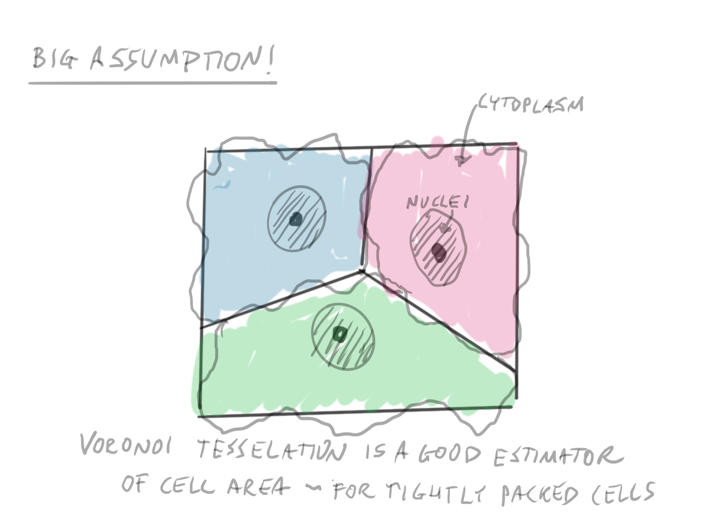

```{r setup, include=FALSE}
library(EBImage)
library(gt)
image <- readImage("image/week4/mickey.png",all = FALSE)
image <- image[,,1]
colorMode(image) <- "grayscale"

```

```{r xaringan-themer, include = FALSE}
library(xaringanthemer)
mono_light(
  base_color = "midnightblue",
  header_font_google = google_font("Josefin Sans"),
  text_font_google   = google_font("Montserrat", "300", "300i"),
  code_font_google   = google_font("Droid Mono"),
  link_color = "deepskyblue1",
  text_font_size = "28px"
)
```

```{r echo=FALSE}
raw_image <- readImage("image/week5/AS_09125_050116030001_D03f00d0.tif")
raw_image <- normalize(raw_image)

otsu_val <- otsu(raw_image)
micro_image <- raw_image > otsu_val


cell_image <- readImage("image/week5/AS_09125_050116030001_D03f00d2.tif")

cell_mask <- normalize(cell_image) > 0.04
cell_mask <- opening(cell_mask, makeBrush(size=5, shape = "disc"))
cell_mask <- fillHull(cell_mask)
#plot(cell_mask)

#micro_image <- readImage("image/week3/otsu_image.png")
#micro_image <- micro_image[,,1]
colorMode(micro_image) <- "grayscale"
dist_micro <- distmap(micro_image)
w <- watershed(dist_micro)
#raw_image <- readImage("image/week3/raw_image.png")
#raw_image <- raw_image[,,1]
raw_image <- normalize(raw_image)

colorMode(raw_image) <- "grayscale"
test <- propagate(raw_image, seeds = w, mask = cell_mask, lambda = 100)
test2 <-  propagate(raw_image, seeds = w, lambda = 100)

#plot(colorLabels(test))

nuc_image <- paintObjects(w, raw_image, col = "lightgrey")
#res_mask <- plot(colorLabels(test))
res = paintObjects(test, nuc_image, col='white')
res2 = paintObjects(test2, nuc_image, col='white')
#plot(colorLabels(test2))

#plot(nuc_image)
#plot(res)
#plot(res2)
```

class: center, middle

# Finding cell bodies from segmented nuclei


---
# Finding boundaries

.pull-left[
```{r echo=FALSE}
plot(nuc_image)
```
]

.pull-right[
```{r echo=FALSE}
res <- paintObjects(test, raw_image, col='white')
res = paintObjects(w, res, col = "lightgrey")
plot(res)
```
]

???


---


???

A voronoi diagram is a special way to partition a space given a set of seeds, or centers. These seeds in our case is the labeled image of our nuclei. But in other applications, these could be spatial features of importance, such as hospitals

---


???

The voronoi diagram has some really special properties. For any point on the plane, the *region* that the voronoi diagram is in specifies the *closest* seed, or center.

In this case, we have three points, but our orange point is closest to the region it's in.

---


---


---
# How do we find them?


???

http://datagenetics.com/blog/may12017/index.html

---


???

http://datagenetics.com/blog/may12017/index.html

---


???

http://datagenetics.com/blog/may12017/index.html


---


???

http://datagenetics.com/blog/may12017/index.html

---
# Another view


???

Here is a gif of another way of calculating the regions that was developed by Fortune.

http://datagenetics.com/blog/may12017/index.html


---
.pull-left[
```{r echo=FALSE}
plot(nuc_image)
```
]

.pull-right[
```{r echo=FALSE}
plot(colorLabels(test2))
```
]

???

So, let's apply Voronoi tesselation to our image. It requires a labeled image of nuclei as the seeds.

---

.pull-left[
```{r echo=FALSE}
plot(nuc_image)
```
]

.pull-right[
```{r echo=FALSE}
plot(res2)
```
]

---
.pull-left[
```{r echo=FALSE}
plot(cell_image)

```
]

.pull-right[
```{r echo=FALSE}
plot(cell_mask)
```
Thresholded, opened region of interest
]

???

Clearly, letting voronoi go without restrictions isn't optimal. 

Remember masks? we can limit the areas in the image that the voronoi regions can spread to by adding a mask for the cellular stain.

We're using another image in the stack to do this. I thresholded at a low value, (0.05), applied opening with a brush size of 5, and then filled in any black holes in the image.

---
.pull-left[
```{r echo=FALSE}
plot(nuc_image)
```
]

.pull-right[
```{r echo=FALSE}
plot(colorLabels(test))
```
]

???

You can see the voronoi regions when thhe mask is applied. The regions don't spread beyond the mask, thus making the cells in the mask have reasonable cellular boundaries.

---

.pull-left[
```{r echo=FALSE}
plot(nuc_image)
```
]

.pull-right[
```{r echo=FALSE}
plot(res)
```
]

???

Here's the final result after masking.

---
.pull-left[
```{r echo=FALSE}
plot(res2)
```
non-masked
]

.pull-right[
```{r echo=FALSE}
plot(res)
```
masked version
]

???

Okay, let's get into discussion groups and compare these two versions. 

Are there any shortcomings of using the masked version?

---
# Are they accurate?

What are some things that the boundaries are dependent on?

???

---
#Compute Features

```{r echo=FALSE}
gt(computeFeatures.basic(test, ref = raw_image))
```

???

Combine these with the nuclei information and do statistics on them!

---

# Lab

- Testing the accuracy of Voronoi Tessellations
- Compare the voronoi tessellation to Beta-Catenin stain

---
# Reading

[Voronoi Tessellations](http://datagenetics.com/blog/may12017/index.html)

[Limits of applicability of the Voronoi Tessellation Determined by Centers of Cell Nuclei to Epithelium Methodology](https://www.frontiersin.org/articles/10.3389/fphys.2016.00551/full)

---
# Class Survey

Remember to take the survey!

https://ohsu.ca1.qualtrics.com/jfe/form/SV_e99ek34B878dGap