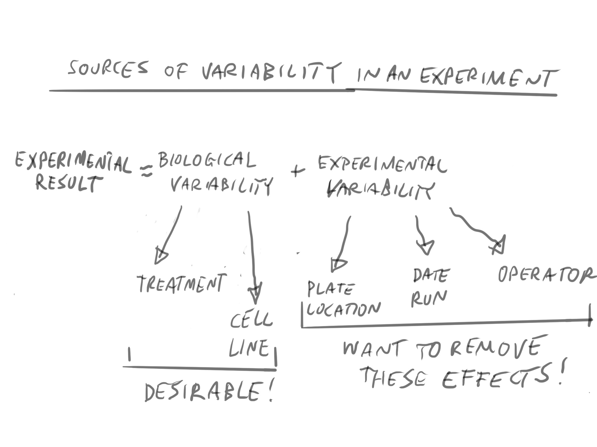
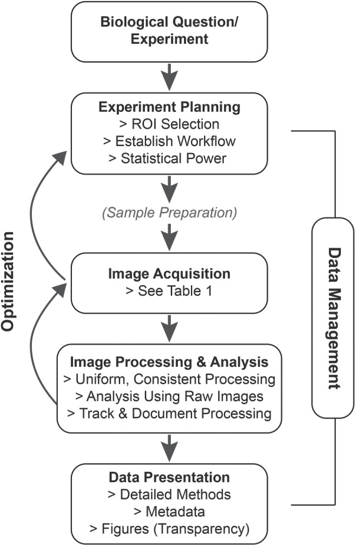
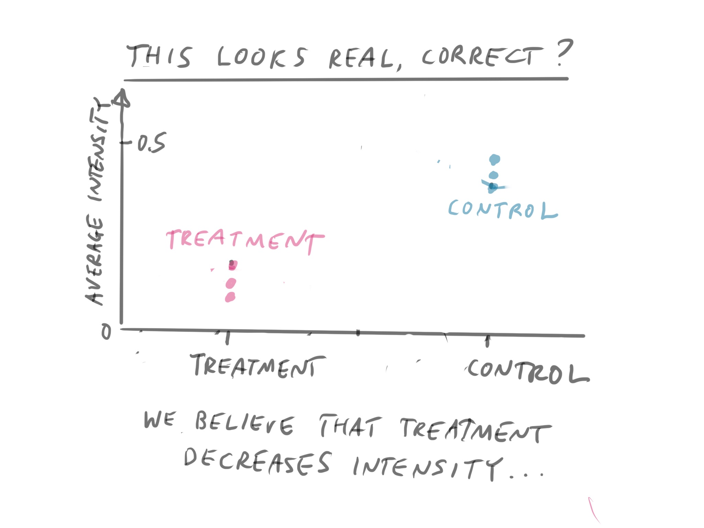
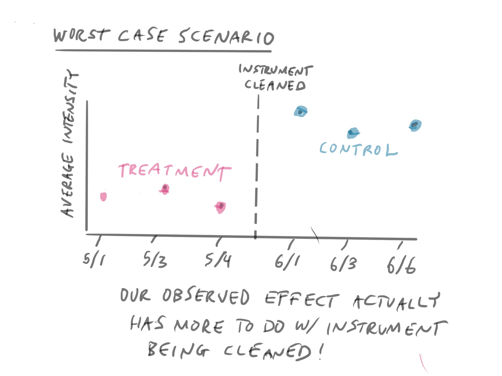
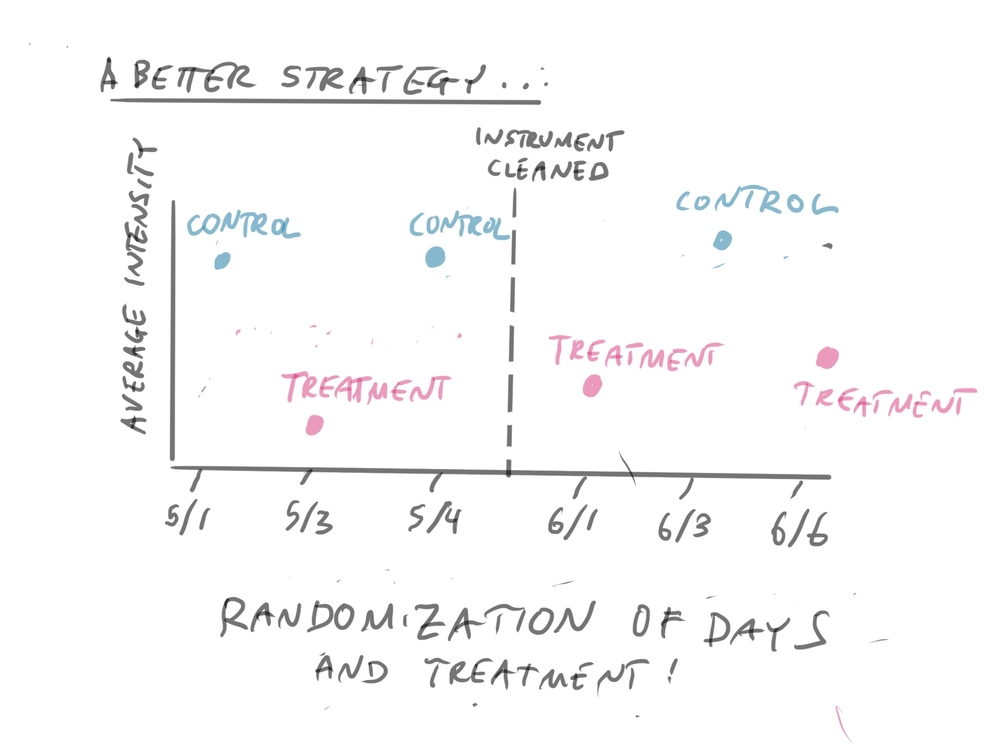
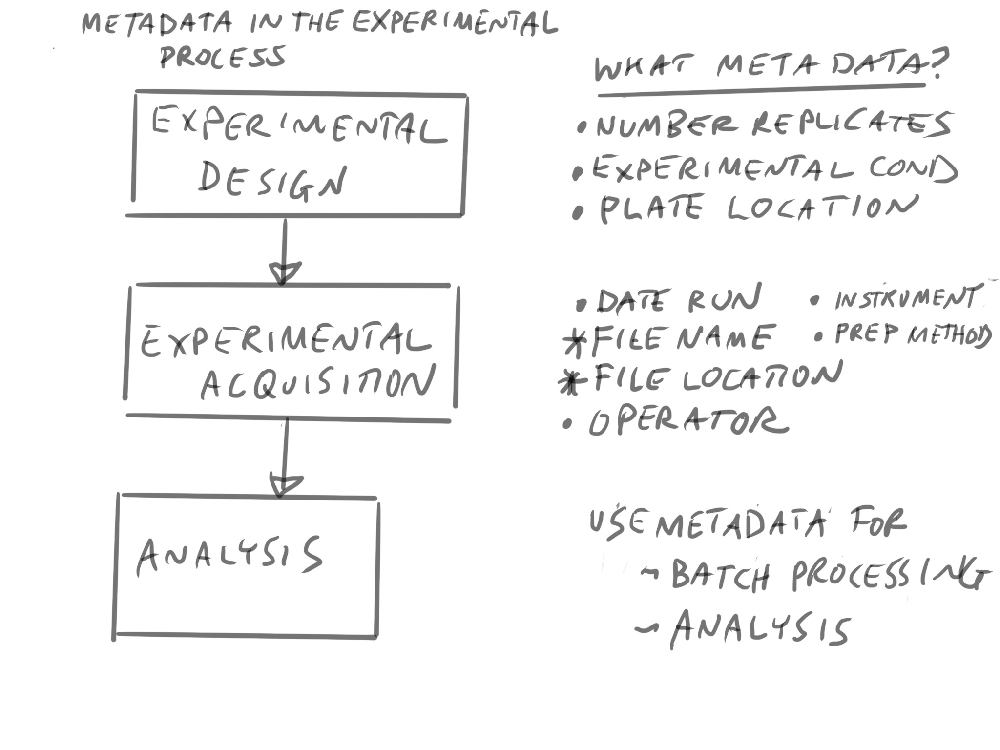
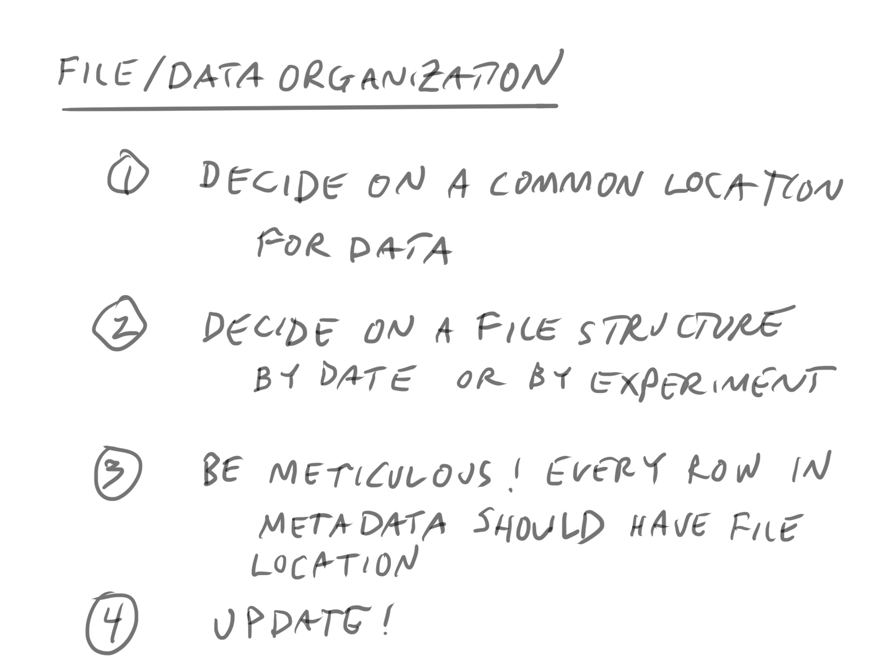
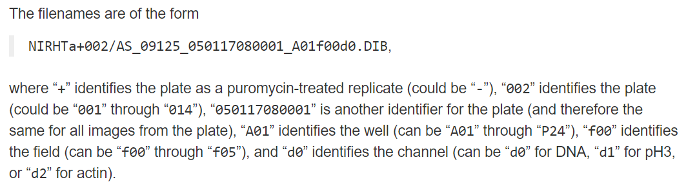
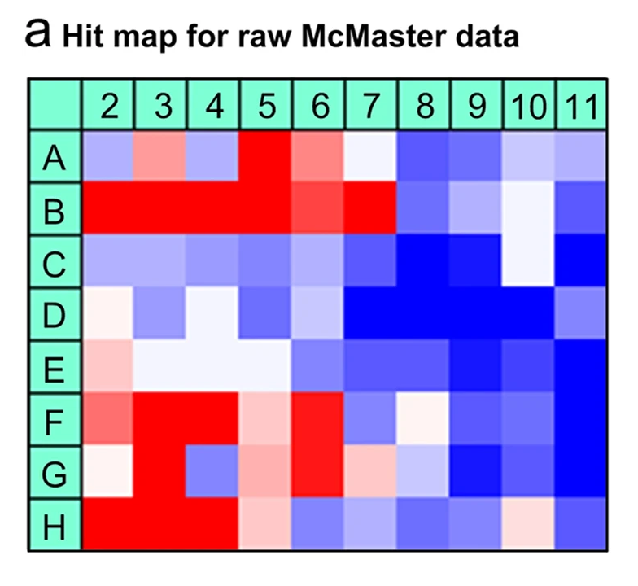

```{r setup, include=FALSE}
options(htmltools.dir.version = FALSE)
library(tidyverse)
metadata <- read.csv("image/week6/metadata.csv") %>% janitor::clean_names()
library(gt)
library(tidyverse)

make_well_plate <- function(covariate_levels, rand=FALSE){
  col_numb <- c(rep(1:12, 8))
  row_numb <- c()
  
  for(rr in letters[1:8]){
    row_numb <- c(row_numb, rep(rr, 12))
  }
  return(data.frame(col=factor(row_numb), row=factor(col_numb)))
  
}

base_plate <- make_well_plate()
treatment_vec <- c(rep("treatment", 48), rep("control", 48))
shuffled_vec <- treatment_vec[sample(96,96)]

#shuf <- lapply(rep(12, 8), sample, 12)
#shuf <- Reduce(c, shuf)
#shuffled_vec <- treatment_vec[shuf]

base_plate <- data.frame(base_plate, condition=treatment_vec)
rand_plate <- data.frame(make_well_plate(), condition = shuffled_vec)
plot1 <- ggplot(base_plate) + aes(y=col, x=row, fill=condition) + 
    geom_tile(color="black") + theme(legend.position = "none")
plot2 <- ggplot(rand_plate) + aes(y=col, x=row, fill=condition) + 
  geom_tile(color="black")  + theme(legend.position = "none")
```

```{r xaringan-themer, include = FALSE}
library(xaringanthemer)
mono_light(
  base_color = "midnightblue",
  header_font_google = google_font("Josefin Sans"),
  text_font_google   = google_font("Montserrat", "300", "300i"),
  code_font_google   = google_font("Droid Mono"),
  link_color = "deepskyblue1",
  text_font_size = "28px"
)
```

# Learning Objectives

- **Understand** the basic experimental design process
- **Learn** the role of metadata in good experimental design
- **Understand** the role of metadata in data and file management
- **Learn** basic file management processes using metadata files

---


???

This is the general framework that we will use when we talk about statistics. There is an observed effect. This observed effect has two sources of variability: *biological variability*, which is what we want to study, and *technical variability*.

Our overall goal is to separate out the effects due to *biological variability* from the *technical variability*. But to do so, we need to keep track of these details.

---
# Experimental Process



???

Let's talk about the overal process of designing, implementing, and analyzing a microscopy experiment. This diagram is from the reading.

https://www.ncbi.nlm.nih.gov/pmc/articles/PMC6080651/

---
# Effect Size is Critical

- Need to know an estimate of the effect size in your experiment
  - I.e, what nuclei size difference do you want to detect?
  - Estimate from pilot experiments
- Effect size drives your choice of number of replicates

---
# Checklist for a Microscopy Experiment

https://www.ncbi.nlm.nih.gov/pmc/articles/PMC6080651/table/T1/?report=objectonly

---
# Biological versus Technical Replicates

- Biological Replicates (Different sample)
  - Good for estimating biological variability
- Technical Replicates (Different aliquots)
  - Good for estimating technical variability

---
class: center, middle
# Without metadata, all is lost

---


???

What is the motivation for being meticulous for your metadata? Say you have an experiment, and you definitely notice there is a difference between cells that undergo a treatment and controls. 

---


???

This is the worst case scenario, where the technical variability cannot be separated from the biological variability. 

We cannot separate the instrument effect (the cleaning) from the biologic effect in these cases because all of the treatment samples were processed in subsequent days and the control samples were processed in subsequent days.

---


???

One of our weapons against technical variability is randomization.

---
# What is Metadata?

- Information you need to process images and make sense of them in analysis
- How the experiment was run
- Conditions of experiment
- Information about samples

---
# Types of Metadata

- Data about experiments
  - Experimental conditions
      - Date/Time Run 
      - Location on Plate 
      - Operator
  - Biological covariates 
      - Treatment/Control Status
      - Cell Line
  - File Location of Images

---
# Example Metadata File

```{r echo=FALSE}
gt(metadata[1:10,])
```

---


---


---
# Naming Conventions



???

Having a naming convention for your files is one of the most powerful things you can do to automate them. If you design your file names so that you can decode the information automatically, you can do some pretty powerful things.

This is not completely necessary if you're doing a good job with your metadata file. 

https://data.broadinstitute.org/bbbc/BBBC017/

---
# File Locations

```{r echo=FALSE}
gt(metadata[,c(1,2,6,7)])
```

???

When you are running the experiment, you will need to decide on a file location that is semi-permanent. This may be in Box, this may be in Research Data Storage, or on your computer. 

Having these locations in a file will make batch processing much easier.

---
# Spatial Bias in a well plate



???

https://www.nature.com/articles/s41598-017-11940-4
  
---
# Randomization

.pull-left[
```{r echo=FALSE}
plot1
```
]
.pull-right[
```{r echo=FALSE}
plot2
```
]

???

As we mentioned, one of our weapons against technical variability is *randomization*. In this example, we have treatment (blue) and control (red).

On the left side, we cannot separate spatial effects from our experimental effects. On the right, we can possibly due to randomization

---
# Randomization

- Randomize experiments over dates/operators/plates
  - Assign conditions as randomly as you can
- If you can't, please make sure this metadata is available
  - Be transparent

---
# Automated Tools for Metadata

- If your instrument lets you keep track of these details in software, do it, and make sure you export this file
- LabKey also has tools to do this as well
- Keep an (updated) copy of the metadata with the data

---
# Things can change

- Document any changes to how the experiment was run
- Be transparent about how they affect the metadata file

---
# Metadata and Batch Processing

- Keeping track of file locations will help you in batch processing
- Can take a list of files and file locations and process them at once
- May have to keep a local copy
  - keep track of your local files

---
# Communicating with the Analyst

- Well annotated metadata will make communicating with a statistician much easier
- Allows you to communicate how the experimental design was translated to experiment
- Remember: if it's not in the metadata, it doesn't exist to the analyst!

---
# Metadata Exercise (in Groups)

.pull-left[
- Take a look at the [experimental details](https://data.broadinstitute.org/bbbc/BBBC017/) 

- Take a look at the [metadata file](https://docs.google.com/spreadsheets/d/1uHyEkxYuTKxXnQDuFI96Rts3Biwv1jV-7TFJK8y8J04/edit?usp=sharing)
]

.pull-right[Identify the following:

- What is the research question?
- Is this metadata for one plate?
- How many replicates are there for each well? Is that reflected in the data?
- How are the files stored? Are they in the same folder?
- What about randomization?
]
---
# Review

- Metadata is critical to all stages of the experimental process
- Metadata makes your experimental design concrete and real
- Result = biological variability + technical variability
- Randomization can help remove technical variability
- Metadata can help you in the data management process
- Metadata is critical in doing a good analysis

---
# Next Time

- Review of basic statistical concepts
- Point estimates and confidence intervals
- Introduction to permutation analysis (there is one test)

---
# Reading

## More on Experimental Design

- [A beginner’s guide to rigor and reproducibility in fluorescence imaging experiments](https://www.ncbi.nlm.nih.gov/pmc/articles/PMC6080651/)

## For Next Session

- [Review of Visualization](https://tladeras.shinyapps.io/dataLiteracyTutorial/) - interactive tutorial
- [Statistics in 30 Minutes](https://www.youtube.com/watch?v=kyjlxsLW1Is) - video
- [Sampling](https://moderndive.com/7-sampling.html) and [Confidence Intervals](https://moderndive.com/8-confidence-intervals.html)
