```{r setup, include=FALSE}
options(htmltools.dir.version = FALSE)
library(tidyverse)
```

# Learning Objectives

- **Understand** point estimates as measurements
- **Understand** that Standard Deviation and confidence intervals are not the same thing
- **Learn** about *confidence intervals* and how we can estimate them from observed data using *bootstrapping*
- **Learn** about *sampling with replacement*.
- *Utilize* bootstrap distributions to estimate confidence intervals
- **Understand** that sampling is the basis for both confidence intervals and hypothesis testing
---

# Cellular Imaging measurements

- We tend to generate a lot of individual measurements from single cells, such as ~500 cells in an image
- We can utilize this to our advantage
- Larger data means we can do better statistics

---

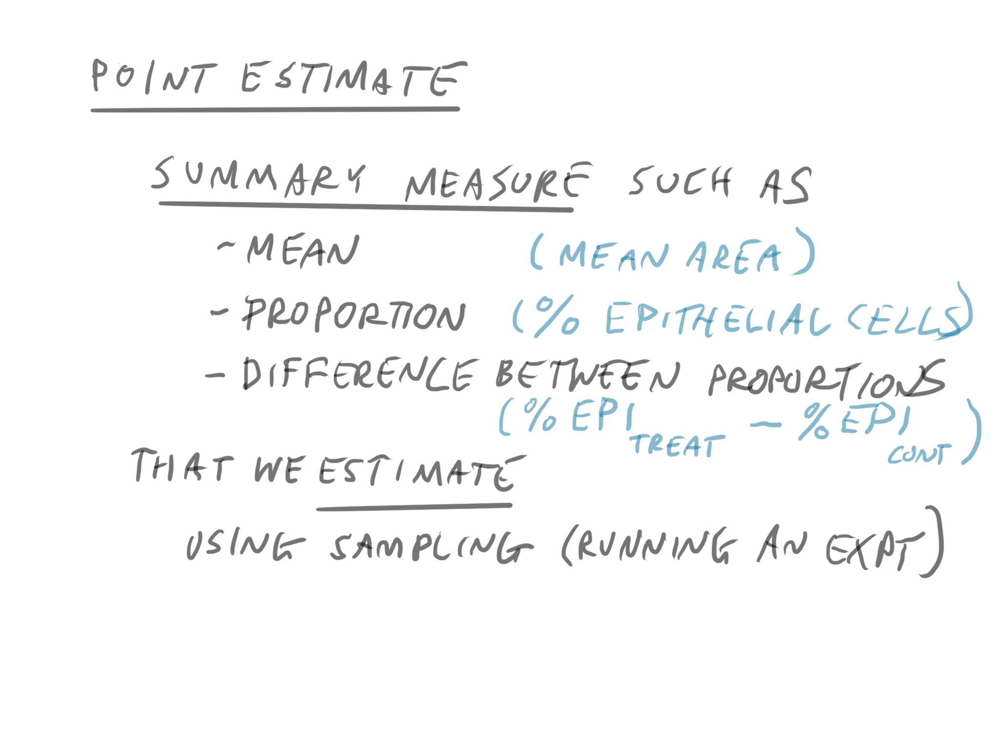

---

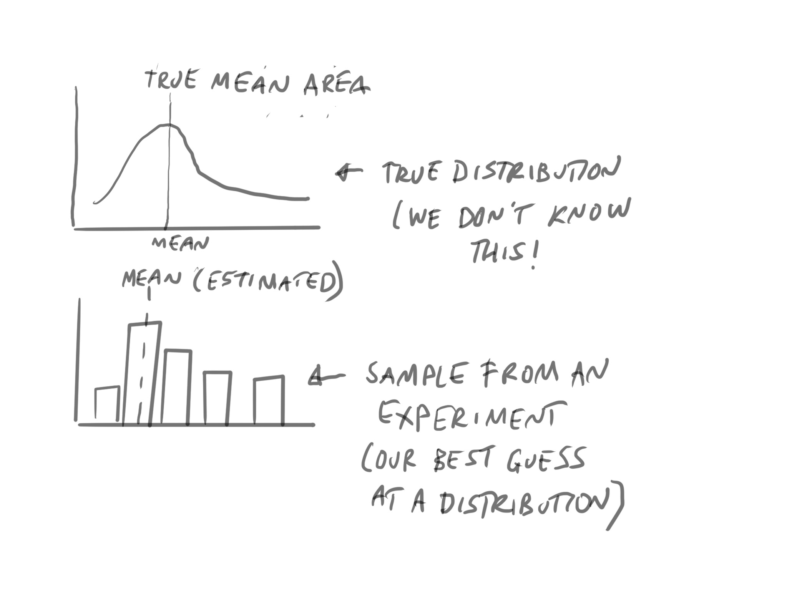

---

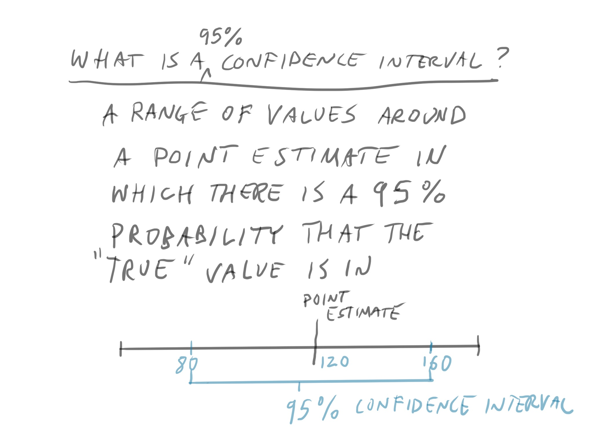

---

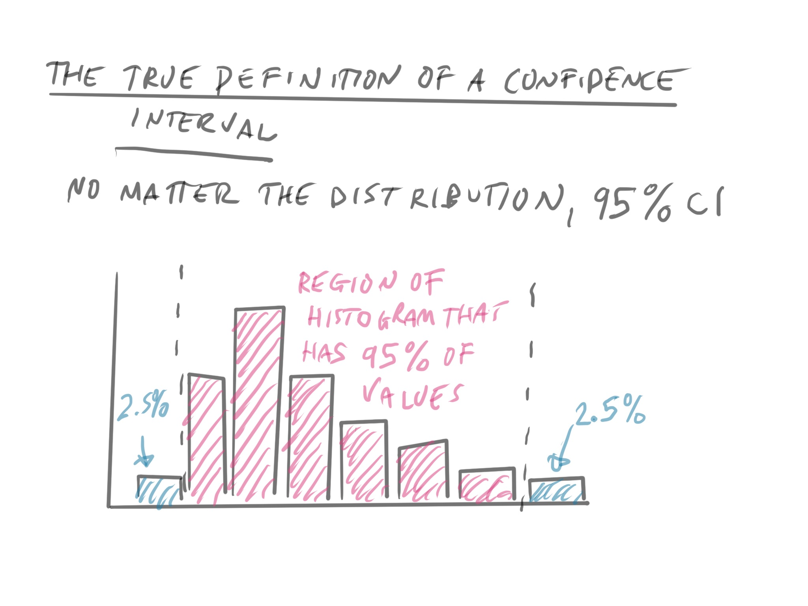

---

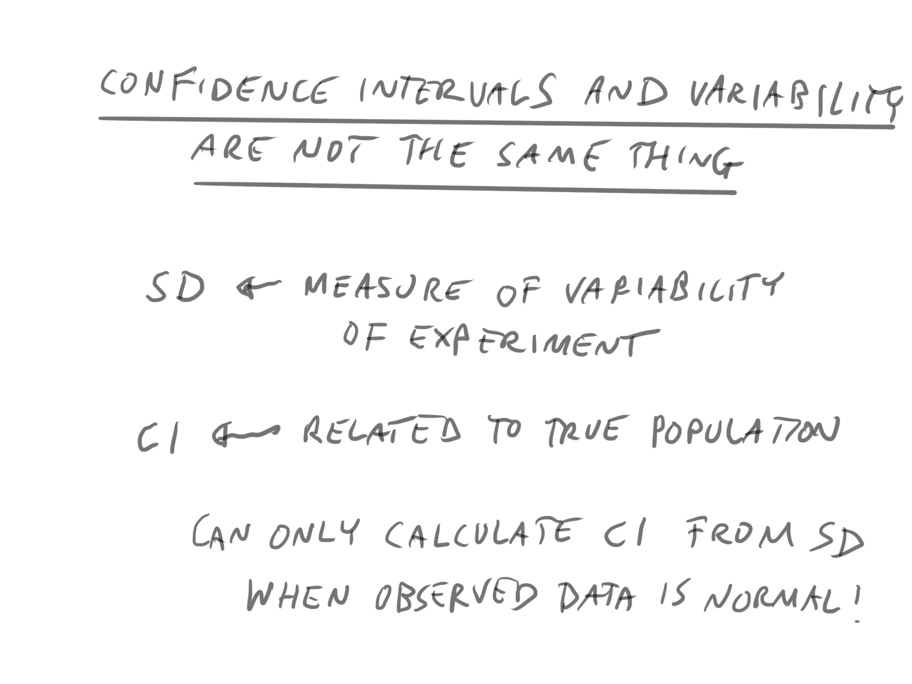

---

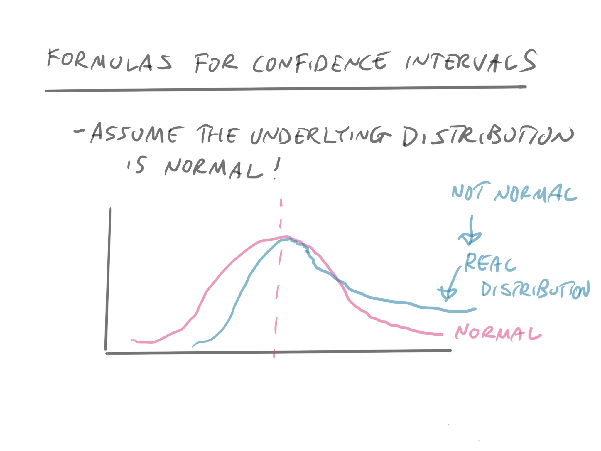

---

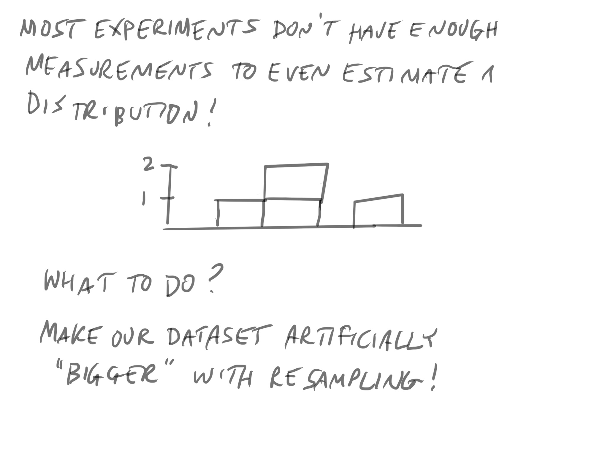

---

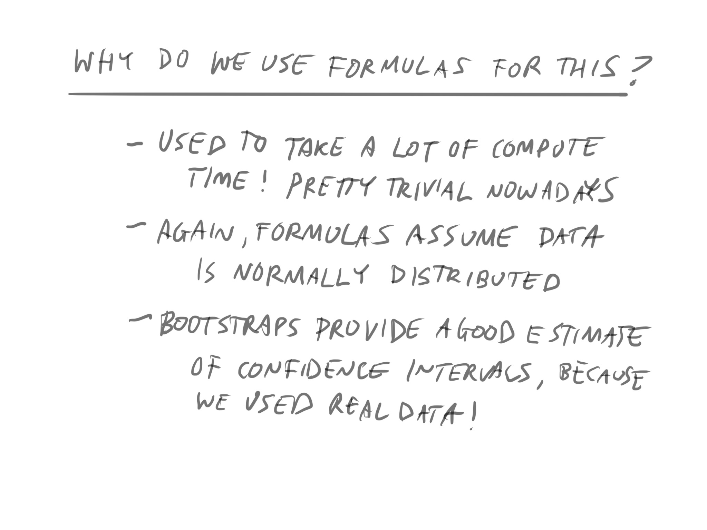


---


???

https://moderndive.com/9-hypothesis-testing.html

---

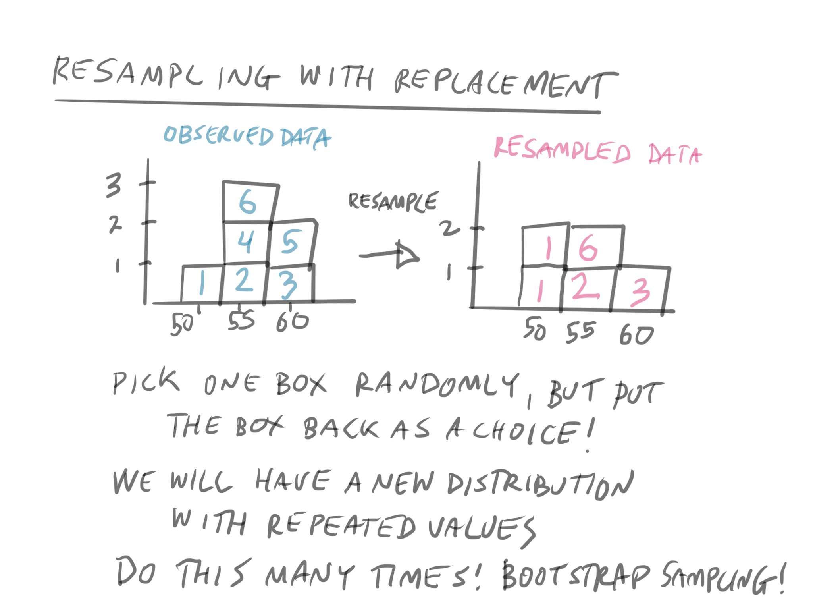

---

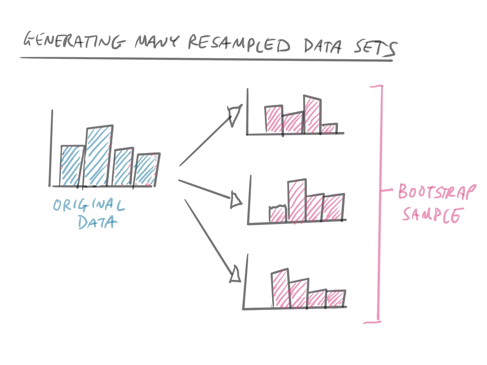

---

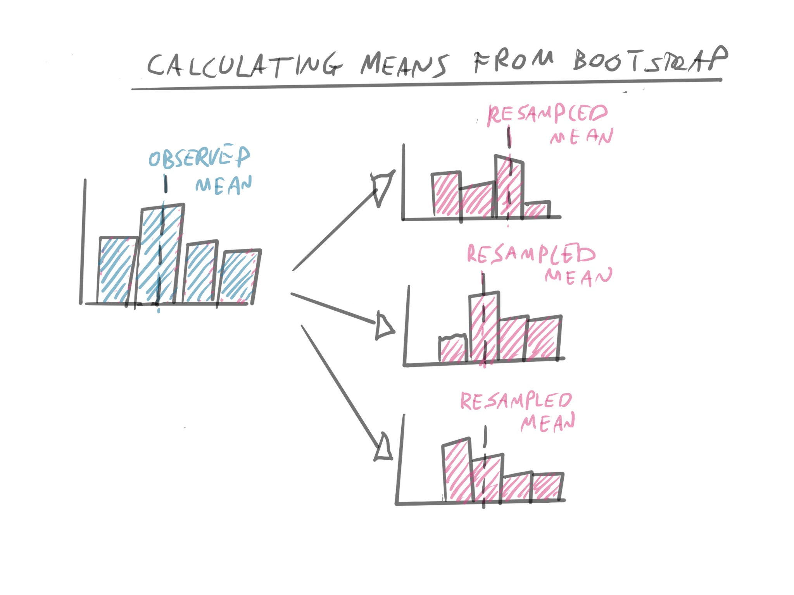

---

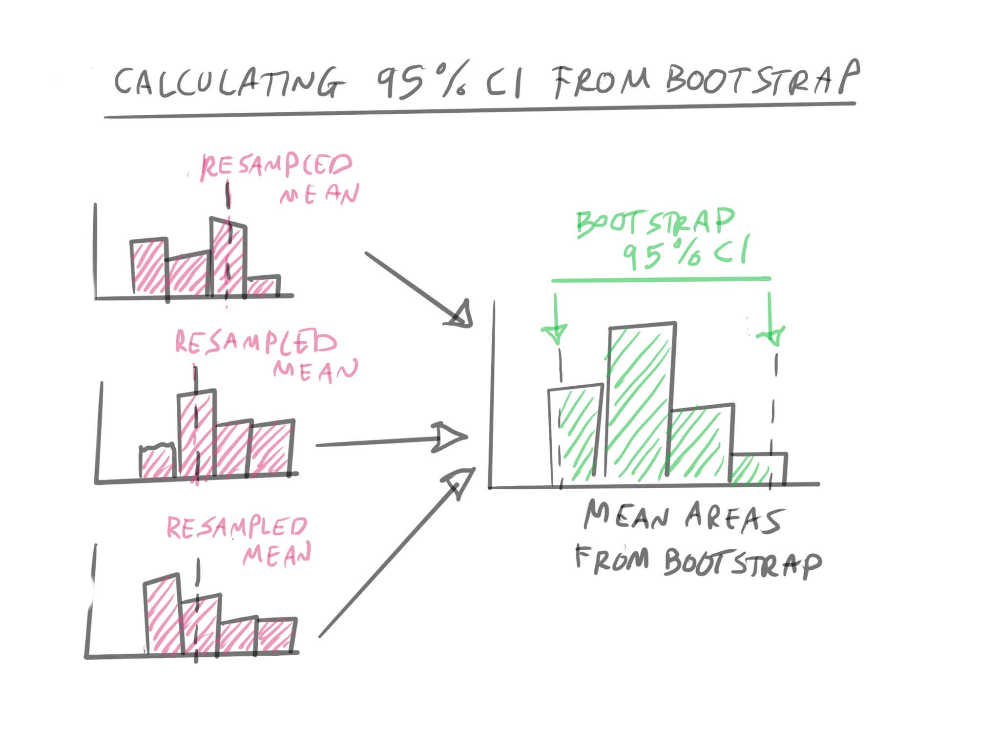

---

# Who Cares?

- Data centric view of calculating CIs
- Does not rely on assumptions of the data
- Can be calculated for any dataset with enough measurements

---


???

https://moderndive.com/9-hypothesis-testing.html

We'll expand this into *hypothesis testing*. We can simulated data under a null hypothesis through permutation.