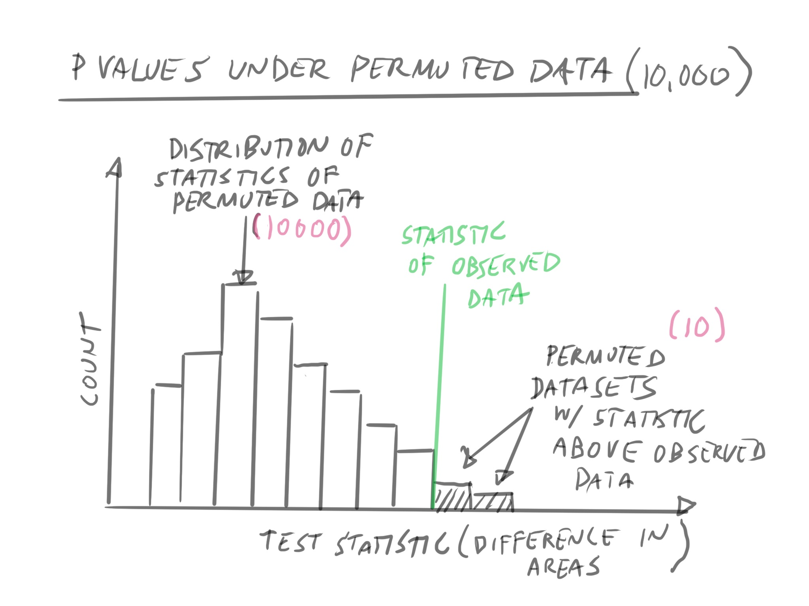

```{r setup, include=FALSE}
knitr::opts_chunk$set(echo = FALSE, message=FALSE, warning=FALSE)
library(tidyverse)
library(gt)
library(janitor)
set.seed(666)
```

```{r xaringan-themer, include = FALSE}
library(xaringanthemer)
mono_light(
  base_color = "midnightblue",
  header_font_google = google_font("Josefin Sans"),
  text_font_google   = google_font("Montserrat", "300", "300i"),
  code_font_google   = google_font("Droid Mono"),
  link_color = "deepskyblue1",
  text_font_size = "28px"
)
```

```{r echo=FALSE}
features <- readr::read_csv("image/week7/features.csv")
features2 <- features %>% select(type, x_0_s_area)

features_bc <- features2 %>% filter(type=="bc")
features_nucleus <- features2 %>% filter(type=="nucleus")
features_nucleus$x_0_s_area <- features_nucleus$x_0_s_area - 225

features2 <- bind_rows(features_bc, features_nucleus)
```

# Learning Objectives

- Understand the steps of hypothesis testing
- Understand that hypothesis testing specifies a null hypothesis
- Understand the importance of the *null hypothesis* in generating the null distribution
- Apply *shuffling* to permute the null distribution
- Interpret the p-value under permutations

---


---
# How Special is our Data?

How special is our data compared to fake data generated under the *null hypothesis*?

---
```{r echo=FALSE, fig.width=10}
samps <- lapply(1:100, function(x){samp <- sample(1:nrow(features2), nrow(features2))
return(samp)})

out_permute <- lapply(1:12, function(x){
  perm <- samps[[x]]
  new_features <- features2
  new_features$type <- new_features$type[perm]
  new_features$run <- x
  return(new_features)
})

out_permute[[7]] <- data.frame(run=7, features2)

test <- dplyr::bind_rows(out_permute)

ggplot(test) + aes(x=type, y=x_0_s_area, fill=type) + geom_boxplot() +
  facet_wrap(vars(run)) + ggtitle("Find the real dataset")
```

---
# Why Hypothesis Test?

- Given our observed sample, assess whether we can make an inference about the real value given:
    - Limited sample size
    - Small Effect size
- What kind of inference? Are we comfortable with our results compared to randomly generated data?

---
# Hypothesis Test

- Test between a *null* and *alternative* hypothesis
- Alternative hypothesis (Ha) - What we're interested in
- Null Hypothesis (Ho) - what we expect from just chance and noise

---
# Steps in Hypothesis Testing

1. Define Test Statistic
2. Specify alternative hypothesis with test statistic
3. Use alternative hypothesis to specify null hypothesis
4. Decide on a significance level
5. Calculate observed test statstic
6. Permute Data and generate distribution
7. Calculate p-value
8. Interpret!
-

???

Adapted from https://www.nedarc.org/statisticalHelp/advancedStatisticalTopics/hypothesisTesting.html

---
# Our Test Statistic

- Difference between means of the two groups
  - `bc` and `nuc`

---


---

---


---
# Empirical versus Theoretical 

- Theoretical distributions rely on assumptions
  - Normality is a big one!
- Empirical distributions utilize data

---


---

---

---

---

---
class: center, middle

# Real Life Example

---
# Our Data

.pull-left[
First few rows of table

```{r}
gt(features2[1:6,])
```
]

.pull-right[
Counts in each group
```{r}
features2 %>% tabyl(type)
```
]

---

# Difference between means in data

```{r}
mean_areas <- features2 %>% group_by(type) %>%
  summarize(type_mean = mean(x_0_s_area))

mean_difference <- mean_areas$type_mean[2] - mean_areas$type_mean[1]
```

.pull-left[
We observe a difference in mean area of `r mean_difference` pixels between the `bc` and `nuc` groups
]

.pull-right[
```{r}
features2 %>% ggplot() + aes(x=type, y=x_0_s_area, fill=type) +
  geom_boxplot() + labs(title = "Observed Data")
```
]
---
```{r}
permute_data <- function(features2, replicates=1000){
  samps <- lapply(1:replicates, 
                  function(x){samp <-   
                    sample(1:nrow(features2), 
                           nrow(features2))
return(samp)})

out_permute <- lapply(1:replicates, function(x){
  perm <- samps[[x]]
  new_features <- features2
  new_features$type <- new_features$type[perm]
  new_features$run <- x
  return(new_features)
})
return(out_permute)
}

find_mean_diffs <- function(features2){
  mean_areas <- features2 %>% group_by(type) %>%
    summarize(type_mean = mean(x_0_s_area))

  mean_difference <- mean_areas$type_mean[2] -   
    mean_areas$type_mean[1]

  mean_difference
  
}

out_permute <- permute_data(features2, replicates = 1000)

mean_diffs <- lapply(out_permute, find_mean_diffs)
mean_diffs <- data.frame(mean_diff= unlist(mean_diffs))

signif_data <- mean_diffs %>% filter(mean_diff >= mean_difference)
```

---
# A couple permutations 

.pull-left[
```{r}
gt(out_permute[[1]][1:5,])
```
]

.pull-right[
```{r}
gt(out_permute[[4]][1:5,])

```
]
---
# Calculate and plot our Observed Statistic 

```{r}
mean_diffs %>% ggplot(aes(x=mean_diff)) + geom_vline(xintercept = mean_difference, color="red") + xlim(range(mean_diffs$mean_diff)) 
```

---
# Generate statistics from permuted data

```{r}
data.frame(mean_diff=mean_diffs[1:10,]) %>% ggplot(aes(x=mean_diff)) + geom_histogram() + geom_vline(xintercept = mean_difference, color="red") +
  labs(title="10 permutations") + xlim(c(-30, 30))
  #annotate(geom = "text", x=)
```

---
# 100 Permutations

```{r}
data.frame(mean_diff=mean_diffs[1:100,]) %>% ggplot(aes(x=mean_diff)) + geom_histogram() + geom_vline(xintercept = mean_difference, color="red") +
  labs(title="100 permutations") + xlim(c(-30, 30))
  #annotate(geom = "text", x=)
```

---
# 1000 Permutations

```{r}
mean_diffs %>% ggplot(aes(x=mean_diff)) + geom_histogram() + geom_vline(xintercept = mean_difference, color="red") +
  labs(title="1000 permutations") + xlim(c(-30, 30))
  #annotate(geom = "text", x=)
```

---
# P-Value

.pull-left[
We observe `r nrow(signif_data)` permuted data sets under the null distirbution have a mean difference of `r mean_difference` or higher.

Our p-value is `r nrow(signif_data)` / 1000 = `r signif(nrow(signif_data)/1000, 3)`
]

.pull-right[

```{r}
mean_diffs %>% ggplot(aes(x=mean_diff)) + geom_histogram() + geom_vline(xintercept = mean_difference, color="red") +
  geom_histogram(data=signif_data, fill="red") #+
  #annotate(geom = "text", x=)
```
]
---
# A Smaller Data Set

```{r}
features3 <- features2[sample(1:nrow(features2), 30),]
features3 %>% tabyl(type)
```

---
```{r}
features3 %>% ggplot(aes(x=type, y=x_0_s_area, fill=type)) + geom_boxplot() + geom_jitter()
```

```{r}
out_permute <- permute_data(features3, replicates = 1000)

mean_diffs <- lapply(out_permute, find_mean_diffs)
mean_diffs <- data.frame(mean_diff= unlist(mean_diffs))

signif_data <- mean_diffs %>% 
  filter(mean_diff >= mean_difference)

nrow(signif_data)
```

---
## Bigger Difference, Smaller n

.pull-left[
We observe `r nrow(signif_data)` permuted data sets under the null distribution have a mean difference of `r mean_difference` or higher.

Our p-value is `r nrow(signif_data)` / 1000 = `r signif(nrow(signif_data)/1000, 3)`

]
.pull-right[
```{r}
mean_diffs %>% ggplot(aes(x=mean_diff)) + geom_histogram() + geom_vline(xintercept = mean_difference, color="red")  +
  geom_histogram(data=signif_data, fill="red")
```
]
---
# There is One Test


---
# Next Time

- Lab: Colocalization analysis using correlation

---
# Reading

- [There's still only one test](http://allendowney.blogspot.com/2016/06/there-is-still-only-one-test.html)
- [The Permutation Test, by Jared Wilber](https://www.jwilber.me/permutationtest/)
- [A practical guide to evaluating colocalization in biological microscopy](https://www.ncbi.nlm.nih.gov/pmc/articles/PMC3074624/)