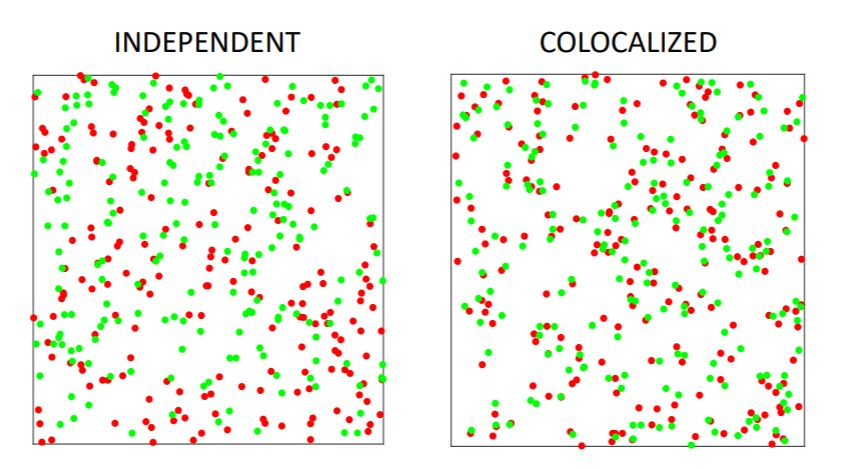

```{r setup, include=FALSE}
knitr::opts_chunk$set(echo = FALSE, message=FALSE, warning=FALSE)
library(tidyverse)
library(gt)
library(janitor)
set.seed(666)
```

```{r xaringan-themer, include = FALSE}
library(xaringanthemer)
mono_light(
  base_color = "midnightblue",
  header_font_google = google_font("Josefin Sans"),
  text_font_google   = google_font("Montserrat", "300", "300i"),
  code_font_google   = google_font("Droid Mono"),
  link_color = "deepskyblue1",
  text_font_size = "28px"
)
```

```{r echo=FALSE}
features <- readr::read_csv("image/week7/features.csv")
features2 <- features %>% select(type, x_0_s_area)

features_bc <- features2 %>% filter(type=="bc")
features_nucleus <- features2 %>% filter(type=="nucleus")
features_nucleus$x_0_s_area <- features_nucleus$x_0_s_area - 225

features2 <- bind_rows(features_bc, features_nucleus)
```

```{r}
library(spatstat)
new_spat <- ppp(x=features$x_0_m_cx, y=features$x_0_m_cy, c(0,1000), c(0,748), marks=factor(features$type))
```


# Learning Objectives

- Understand the roots of spatial point analysis
- Learn about *Density* measures
- Learn about *Average Nearest Neighbor* and its cross version
- Learn about *Ripley's K* and its cross version
- Learn about *Complete Spatial Randomness* 
- Interpret envelope plots of both *Ripley's K* and *ANN*

---
# Caveat

Many of these methods are brand new to microscopy.

Thus, many of them aren't implemented in software, or very well.

They come from spatial analysis and geography.

---
# Object Based Colocalization

- We've extracted features from our images
- Can we do better statistics with the features than just correlation?

---
# Starting point: X and Y coordinates

```{r fig.width=10, fig.height=5}
features %>% ggplot(aes(x=x_0_m_cx, y=x_0_m_cy, color=type)) + geom_point(alpha=0.5) + scale_color_manual(values=c("bc"="green", "nucleus"="red")) + labs(x="x (pixels)", y="y (pixels)")

```

???

The starting point for spatial analysis are the x and y coordinates of our features. 

Each of these features can have a *mark*.

In our case the marks are from the Red and Green Channels.

---
# Window of Sampling

- Need to specify the window of sampling
- Changes aspects of the modeling

---
# What is our range of interest?

- Need to define this explicitly
- Calculate metrics over this range of interest
- Compare to outside of this range

---
# Concepts: First order versus Second Order


???

This figure again is from geography, but we can talk about

first order properties - properties dependent on the geographical properties, such as chemical gradient

second order properties - properties dependent on neighbors

---
# Discussion 

- What are some 1st order properties in microscopy of cells?
- What are some 2nd order properties in microscopy of cells?

---
# Concepts: Density

- Can be *global* or *locally* calculated
- Often a good first exploration of the data

---
#Local Density: Quadrat

```{r}
Q <- quadratcount(new_spat, nx=5, ny=3)
plot(new_spat)
plot(Q, add=TRUE, col="blue", cex=1.5, lty=2)
```
---
#Local Density: Density Plot
```{r}
plot(density(new_spat, 10), main="density plot")
```

---
# Concepts: Distance

- Euclidean distance between point that is nearest to a point
- Find all neareset neighbors

---


---
# Average Nearest Neighbor (ANN)


???

---
# Order plot


???

The order plot can often give us clues about the structure.

---
# The shape of the order plot


???

You can see that the shape

---

---


---


---


---
class: center, middle

# Where do the statistics come from?


---
# Complete Spatial Randomness


??? 

The null distributions we usually compare our data set to adhere to "Complete Spatial Random"

Our *process* of generating the CSR data is independent, with proteins popping up in random spots

Obviously, biological processes of cell growth are different, which suggests we probably need a good way of generating a random distribution that models this process. No one has gone there yet.

---


???

http://wwwf.imperial.ac.uk/~eakc07/QBItalk.pdf

Here we compare our two channels, on the left both channels have been generated by a CSR process. 

---
# Expected versus Observed

- *Observed* - the observed value of our statistic for our data
- *Expected* (or *Theoretical*) - the value of our statistic calculated under null distribution
  - Complete Spatial Randomness

---
# Alternative Versus Null

- Ha: The observed value and theoretical values are not identical
- Ho: The observed value and theoretical values are identical

---
# Generate Random Datasets

```{r}
win <- owin(c(0,1000), c(0,750))
num_cells <- nrow(features)
samp <- sample(c("nucleus", "bc"), num_cells, replace=TRUE)
data <- rpoint(n = num_cells, win = win)
data <- data %mark% samp
```
```{r}
plot(data)
```

???

We can generate random data under the null hypothesis

---
# Ripley's K

```{r}
test <- Kest(data)
test
```

---
# Calculate over all fake datasets

```{r echo=TRUE}
test <- envelope(new_spat, Kcross, nsim=1000, r=c(0,30))

```

??? 

We can generate our null distribution using this process. We calculate it over a range of radii from 0 pixels to 30 pixels

---
```{r}
plot(test)
```

???

The grey band represents the null distribution of K at different radi for datasets randomly generated under CSR. 

We look at our observed line, and notice that it's outside of the null distribution. 

Thus K is greater than expected over the range of 0-30 pixels

---
# Generate for ANN

```{r echo=TRUE}
gc <- envelope(new_spat, Gcross)
```

???

There is a related metric to Average nearest neighbor called G. We generate a new distribution.

---
# Average Nearest Neighbor Statistics

```{r message=FALSE}
plot(gc)
```

The plot for G is similar to our order plot, but with the band representing the null distribution. 

We see across the 1st to 5th orders, the value of our G is greater than the theoretical G, which suggests colocalization across these orders.

---

# Reporting colocalization

- Must always report within a range

---
# Nearest Neighbor Distances (percentage)

```{r}
nnd <- nndist(new_spat, by=marks(new_spat)) %>% data.frame()
nnd_bc <- nnd$bc
perc <- length(nnd_bc[nnd_bc < 10])/length(nnd_bc)
```

.pull-left[
`r signif(perc*100, 2)` percent of bc cells had a nearest neighbor of nucleus within 10 pixels
]

.pull-right[
```{r}
nnd %>% ggplot() + aes(x=bc) + geom_histogram() +
  geom_vline(xintercept=10) + 
  labs(title = "1st nearest neighbor distances", 
       subtitle = "From bc to nucleus", x="1st neighbor distance")

```
]

---
# Still trying to understand this


---
# Lab

- Working with `spatstat` package
- Generating Complete spatial random data
- Working with Ripley's K and Average Nearest Neighbor

---
# Reading

- [Point Pattern Analysis](https://mgimond.github.io/Spatial/point-pattern-analysis.html)
- [Hypothesis Testing](https://mgimond.github.io/Spatial/hypothesis-testing.html)
- [Point Pattern Analysis in R](https://mgimond.github.io/Spatial/point-pattern-analysis-in-r.html)