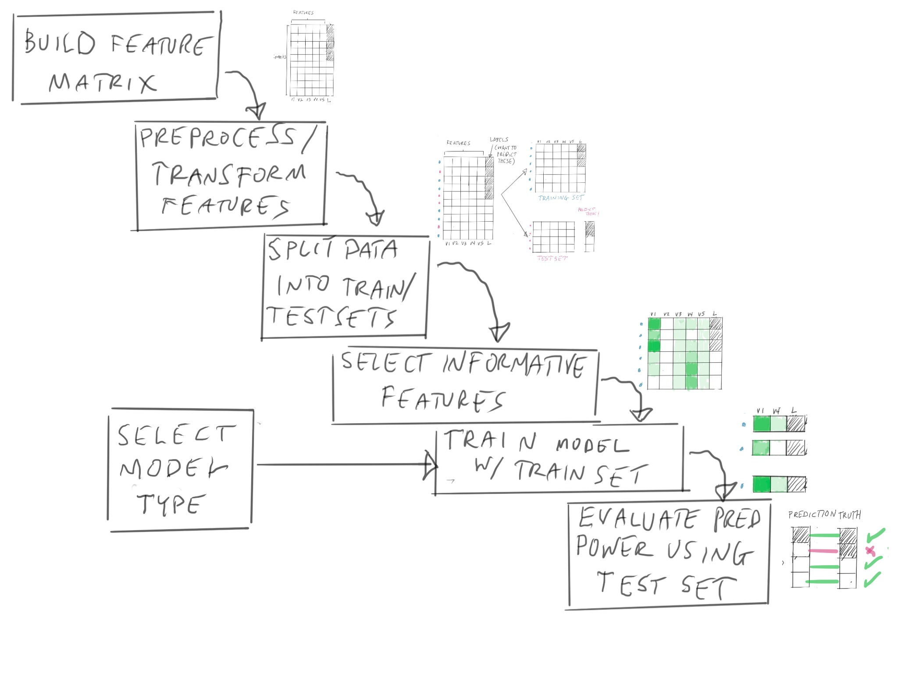

```{r setup, include=FALSE}
knitr::opts_chunk$set(message=FALSE, warning=FALSE)
library(tidyverse)
library(gt)
library(janitor)
set.seed(666)
```

```{r xaringan-themer, include = FALSE}
library(xaringanthemer)
mono_light(
  base_color = "midnightblue",
  header_font_google = google_font("Josefin Sans"),
  text_font_google   = google_font("Montserrat", "300", "300i"),
  code_font_google   = google_font("Droid Mono"),
  link_color = "deepskyblue1",
  text_font_size = "28px"
)
```

# Learning Objectives

- **Learn** the different types of machine learning
- **Learn** the basic phases of supervised machine learning and the `tidymodels` functions associated with them
- **Learn how to evaluate** the predictive power of a model/learner

---

# What is Machine Learning?

- "The study of computer algorithms that improve automatically through experience"
- Using algorithms to find predictive patterns in the data

---
# Types of Machine Learning

- **Unsupervised** - discovering groups in data without labels
  - Dimension reduction, clustering
- **Supervised** - learning how to predict labels using *features*
  - Labels: phenotype:
      - Cell Type
      - Mechanism of Action
      - Treatment/Non-Treatment

---
# Types of Supervised Learners

Ordered in terms of *interpretability*

- Decision Trees
- Logistic Regression
- Support Vector Machines
- Neural Nets

---
# `tidymodels`

General framework for machine learning, allows you access to many different machine learning packages, such as TensorFlow

Learn one workflow, use many different algorithms!


---


---


---
# `recipes`

The `recipes` package in `tidymodels` outlines approaches to transform data, using `step_` functions

https://www.tidymodels.org/start/recipes/

```
recipe(~., data = all_features) %>%
  update_role(plate, well, dose, pos_neg_ctrls, new_role="id") %>%
  step_normalize(all_predictors())
```

---
# General Transformation Workflow

- Impute
- Individual transformations for skewness and other issues
- Discretize (if needed and if you have no other choice)
- Create dummy variables
- Create interactions
- Normalization steps (center, scale, range, etc)
- Multivariate transformation (e.g. PCA, spatial sign, etc)

---


---


---


---

# `rsample::initial_split()`

The function `initial_split()` from `rsample` package in `tidymodels` handles splitting data into test/train sets.

```{r eval=FALSE}
all_features_split <- initial_split(all_features, 
                                prop = 3/4)
all_features_train <- training(all_features_split)
all_features_test <- testing(all_features_split)
```

---


---


---


---
## `recipeselectors` for feature selection

New package, allows for selecting features by

- importance (predictive power)
- association 
- correlation (for numeric outcomes)

https://stevenpawley.github.io/recipeselectors/

---


---
# Specifying a Model Type

Specifying logistic regression as a model:

```
lr_mod <- 
  logistic_reg() %>% 
  set_engine("glm")
```

---
# `fit()` for training models

The `fit()` function in `tidymodels` (`parsnip`) lets you train a model based on the training data

```{r eval=FALSE}
lr_fit <- fit(lr_mod, formula= dose ~ ., data=all_features_train)
```
---


---


---
# `collect_metrics()` for evaluating on test set

`collect_metrics()` from `tidymodels` allows you to calculate metrics on predictions including:

- Accuracy
- Balanced Accuracy
- Area under the Reciever Operating Curve (ROC)

```{r eval = FALSE}
lr_fit %>%
  collect_metrics()
```

---
# Summary of workflow

- Variable Transformations: `recipes` package
- Splitting data: `rsample::initial_split()`
- Feature selection `recipeselectors` package
- Specifying a model: `parsnip` package
- Training the model: `fit()`
- Evaluating the model: `collect_metrics()`

---
# A Caution

The tendency of people to treat learners as a black box is not only unethical, but it provides no insight as to mechanism.

We usually want models to be *interpretable*. We need to know why the model is making a decision.

Especially important as models are used in *social* contexts, such as social media, etc.

---
# A Full Case Study

https://www.tidymodels.org/start/case-study/

---
# Last Lab

Predicting dosage from cellular images

---
# Reading

Machine Learning in Cell Biology: https://jcs.biologists.org/content/126/24/5529

---
# Final Lecture Survey

Use `Week 11`:

https://ohsu.ca1.qualtrics.com/jfe/form/SV_e99ek34B878dGap
